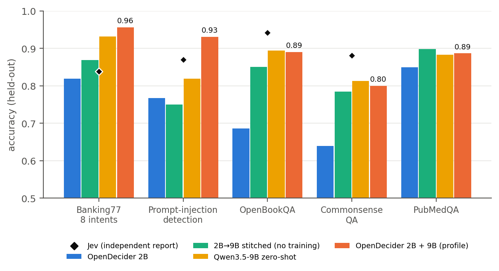
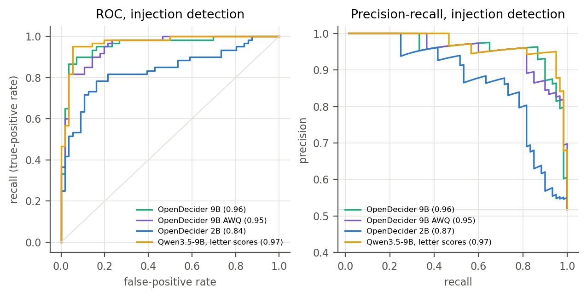
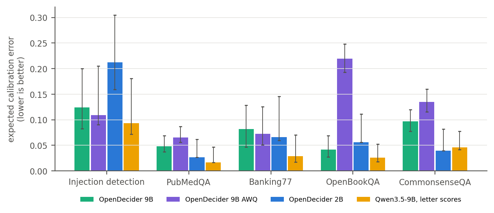
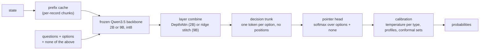

<p align="center">
  
</p>

<p align="center">
  <b>Calibrated typed decisions from open LLMs. No text generation.</b><br>
  State and typed questions in. Probabilities over your options out. Runs locally, down to a Jetson.
</p>

<p align="center">
  
  
  
  
  
</p>

---

OpenDecider is an open decision model. You send a state (text or JSON) and a set of typed questions. It returns a
calibrated probability for each option, plus the probability that none of your options fits. It never writes free text
on the decision path.

It started as a public hypothesis test: can a model built only from published methods and open weights reproduce the
observable behavior of TypeSafe's Jev? It reports where the result is consistent or inconsistent with public
observations, and makes no claim about how Jev is built. The released checkpoints are trained only on data with clean
provenance (no share-alike, non-commercial or unlicensed sources, and no labels produced by a model).

```text
state + { route: choice[billing, technical, refund, other], urgent: noul, severity: score[low..critical] }
  └─> { route: {refund: 0.81, billing: 0.12, ...}, urgent: {p_yes: 0.34}, severity: {expected_index: 2.1, ...}, none: 0.03 }
```

## Contents

- [Features](#features)
- [Results](#results)
  - [Beyond accuracy](#beyond-accuracy)
- [How we measure, and why](#how-we-measure-and-why)
- [How it works](#how-it-works)
- [Requirements](#requirements)
- [Quickstart](#quickstart)
- [Checkpoints](#checkpoints)
- [API](#api)
- [Limitations](#limitations)
- [Roadmap](#roadmap)
- [Reproduce](#reproduce)
- [Project layout](#project-layout)
- [License](#license)

## Features

| Feature | What it does |
|---|---|
| Typed questions | `choice` (up to 255 options, more with a two-stage shortlist), `noul` (yes/no), `score` (ordinal levels with an expected value). |
| Order invariance | Option order does not change the output. One pass, no permutation averaging. Unit-tested. |
| `none` option | Every question gets a "none of the above" option. It is trained (correct option removed or question unanswerable → `none`), and its probability is reported next to your options. |
| Calibration | Trained with cross-entropy plus Brier, temperatures fitted per question type. `POST /v1/calibrate` fits a profile from your labels and picks the calibrator by cross-validation. |
| Conformal sets | `"conformal": {"alpha": 0.1}` returns the options that cannot be ruled out at that level, and whether to abstain. |
| Prefix cache | States are cached across requests at record boundaries. A state that grows (events, logs) only pays for the new records. |
| Retrieval store | SQLite store with BM25 plus dense search. It builds a state from a large record collection under a token budget. |
| Explanations | Optional `POST /v1/explain`. The same backbone writes a short explanation, cites the records that drove the decision, and scores its own faithfulness. |
| Local | Frozen Qwen3.5 backbone, int8 weights and caches. Reference device: Jetson AGX Orin. |

## Results

Zero-shot: no data from these benchmarks was used for training, tuning or data generation (see
[How we measure, and why](#how-we-measure-and-why) for what that does and does not rule out). Brackets are 95%
bootstrap intervals (1,000 resamples). Full tables: [`docs/RESULTS.md`](docs/RESULTS.md) §13–17.

### Benchmarks with real labels

<p align="center"></p>

| | Banking77 (8 intents) | Prompt-injection detection | OpenBookQA | CommonsenseQA | PubMedQA |
|---|---|---|---|---|---|
| OpenDecider 9B | 0.875 [0.82, 0.93] | 0.810 [0.74, 0.87] | 0.884 [0.86, 0.91] | 0.800 [0.78, 0.83] | **0.891** [0.87, 0.91] |
| OpenDecider 2B | 0.831 [0.78, 0.89] | 0.681 [0.59, 0.77] | 0.670 [0.63, 0.71] | 0.651 [0.62, 0.68] | 0.845 [0.82, 0.87] |
| Qwen3.5-9B, letter scores (our run) | **0.931** [0.89, 0.97] | 0.819 [0.75, 0.89] | 0.894 [0.87, 0.92] | 0.813 [0.79, 0.84] | 0.883 [0.86, 0.90] |
| Jev 1.13, third-party reports | 0.838 [a] | 0.870 [a] | 0.942 [b] | 0.881 [b] | – |

- Sizes: Banking77 8 intents × 20 (160), deepset/prompt-injections test split (116), OpenBookQA test (500),
  CommonsenseQA validation (1,000), PubMedQA labelled (890).
- Qwen3.5-9B letter scores: the same 9B backbone (Q4_0 GGUF) answering with option letters, log-probabilities
  renormalized over the options. It is the natural baseline: OpenDecider 9B is within about 1 to 2 points of it on four
  sets and ahead on PubMedQA; it adds `none`, calibrated types, order invariance and the decision API on top.
- Jev numbers were not reproduced here (no API access) and come from different splits:
  [a] AY Automate, [Jev vs LLM benchmark](https://www.ayautomate.com/blog/jev-vs-llm-benchmark): Banking77 160 items (same
  size as ours, intents not listed); injection detection on 400 deepset texts. [b] scienthoon,
  [jev-ood-calibration](https://github.com/scienthoon/jev-ood-calibration): OpenBookQA and CommonsenseQA validation
  splits. Retrieved 2026-09-23. Our results are consistent with Jev being ahead on knowledge-heavy multiple choice and
  injection detection, and behind on Banking77.
- Banking77: 17 of the 9B's 20 errors are one intent, "get physical card", whose messages in Banking77 are mostly about
  the card PIN; a zero-shot model sees only the label name. Qwen's letter scores get 15 of those 20 right. That one
  intent is more than the whole gap between the two (12 vs 9 messages): on the other seven intents the 9B is slightly
  ahead, 137 vs 134 of 140 (`docs/RESULTS.md` §17.3).
- Prompt-injection detection is a classification task: the model labels each text as an injection attempt or a
  normal request. It does not measure whether the model itself resists instructions injected into a state.

### Prompt-injection detection

| | Injections caught (recall) | False alarms | Precision | F1 | MCC | ROC-AUC | PR-AUC |
|---|---|---|---|---|---|---|---|
| OpenDecider 9B | 39 / 60 | 1 / 56 | 0.97 | 0.78 | 0.66 | 0.96 | 0.96 |
| OpenDecider 9B AWQ | 38 / 60 | 2 / 56 | 0.95 | 0.76 | 0.63 | 0.95 | 0.95 |
| OpenDecider 2B | 24 / 60 | 1 / 56 | 0.96 | 0.56 | 0.46 | 0.84 | 0.87 |
| Qwen3.5-9B, letter scores | 41 / 60 | 2 / 56 | 0.95 | 0.80 | 0.67 | 0.97 | 0.97 |

At P(injection) >= 0.5 on deepset's 116 test inputs; intervals, curves and the other benchmarks are in
`docs/RESULTS.md` §17. The models rank injections well but are conservative: the mild injections in this benchmark get
probabilities around 0.3 to 0.5. With 25 to 50 labelled examples, isotonic calibration (`POST /v1/calibrate`) moves the threshold; on the
stitched 9B this raised accuracy to 0.84 to 0.85. That is a fitted result, measured on halves of the benchmark itself,
and is reported separately in `docs/RESULTS.md` §14.

### Beyond accuracy

One accuracy number hides how a model errs. For each benchmark we also report the measures that fit the task, from
the same predictions, with 95% bootstrap intervals: all tables, curves and caveats in
[`docs/RESULTS.md` §17](docs/RESULTS.md#17-task-appropriate-metrics-beyond-accuracy-2026-10-04) (script:
`eval/report_metrics.py`).

<p align="center"></p>

<p align="center"></p>

| | PubMedQA F1 / MCC / ROC-AUC | Banking77 macro-F1 | OpenBookQA ECE | CommonsenseQA ECE |
|---|---|---|---|---|
| OpenDecider 9B | 0.91 / 0.77 / 0.96 | 0.85 | 0.042 | 0.097 |
| OpenDecider 9B AWQ | 0.90 / 0.74 / 0.95 | 0.86 | 0.220 | 0.135 |
| OpenDecider 2B | 0.88 / 0.67 / 0.91 | 0.81 | 0.056 | 0.039 |
| Qwen3.5-9B, letter scores | 0.90 / 0.76 / 0.95 | 0.93 | 0.026 | 0.046 |

- Injection detection: good ranking (ROC-AUC 0.96 for the 9B), but at the default threshold the models miss attacks
  rather than raise false alarms (table above).
- Banking77: most of the 9B's errors are one intent whose label name does not describe its messages (confusion matrix
  in §17.3).
- Multiple choice: no system prefers an answer position (§17.4).
- Calibration: Qwen's letter scores are the best calibrated; the 4-bit 9B, whose temperatures were not refitted, is
  underconfident on multiple choice. Reliability diagrams per system and benchmark are in §17.5.

### `none` option and conformal sets

Held-out questions from the five benchmarks above, asked as written, with the correct option removed, with only the two
most plausible wrong options left, or about an unrelated state. AUROC of P(none) against the answerable questions:

| | Correct option removed | Only plausible wrong options | Unrelated state |
|---|---|---|---|
| OpenDecider 9B | 0.893 [0.87, 0.91] | 0.880 [0.86, 0.90] | 0.808 [0.79, 0.83] |
| OpenDecider 9B AWQ (4-bit) | 0.892 [0.87, 0.91] | 0.909 [0.89, 0.92] | 0.710 [0.68, 0.74] |
| OpenDecider 2B | 0.817 [0.79, 0.84] | 0.803 [0.78, 0.83] | 0.816 [0.79, 0.84] |
| Previous 2B release (no `none` training) | 0.716 [0.68, 0.74] | 0.760 [0.73, 0.79] | 0.854 [0.84, 0.87] |

Conformal sets at α = 0.1, with the calibration scores stored in each checkpoint (fitted on our own training
families, so these benchmarks are a distribution shift):

| | Coverage (answerable) | Mean set size | Abstains: answerable | Abstains: correct option removed | Abstains: unrelated state |
|---|---|---|---|---|---|
| OpenDecider 9B | 0.962 | 1.47 | 35% | 72% | 93% |
| OpenDecider 2B | 0.947 | 2.07 | 61% | 85% | 87% |

Coverage stays above the 90% target under this shift, and the models abstain far more often when no listed option
is right. The sets are wider than they would be in-distribution; refit them on your own labels (`docs/RESULTS.md`
§13.4).

### Memory and latency (Jetson AGX Orin)

One fresh process per configuration, eager kernels. Accuracy on 500 typed-decisions questions (secondary) / Banking77
8 intents / prompt-injection detection.

| Model, weights / cache | Weights on GPU | Peak GPU memory, 0.8k / 3.7k / 15k-token state | Latency, same states | Accuracy |
|---|---|---|---|---|
| 2B, int8 / int8 (default) | 1.88 GB | 2.4 / 2.5 / 3.1 GB | 1.04 / 1.95 / 6.05 s | 0.414 / 0.831 / 0.681 |
| 2B, int8 / int4 | 1.88 GB | 2.4 / 2.5 / 3.1 GB | 1.05 / 1.95 / 6.08 s | 0.412 / 0.825 / 0.664 |
| 2B, AWQ int4 / int8 | 1.32 GB | 1.8 / 1.9 / 2.5 GB | 0.93 / 2.23 / 7.72 s | 0.446 / 0.863 / 0.647 |
| 2B, NF4 / int8 | 1.26 GB | 1.8 / 1.9 / 2.5 GB | 0.83 / 1.73 / 5.84 s | 0.384 / 0.775 / 0.638 |
| 9B, int8 / int8 (default; Q4_0 GGUF download, int8 on the GPU) | 8.62 GB | 9.9 / 10.0 / 11.1 GB | 3.68 / 7.52 / 21.4 s | 0.560 / 0.875 / 0.810 |
| 9B, int8 / int4 | 8.62 GB | 9.9 / 10.0 / 11.1 GB | 3.70 / 7.55 / 21.4 s | 0.546 / 0.881 / 0.793 |
| 9B AWQ (`opendecider-9b-awq`), int4 / int4 | 5.74 GB | 6.9 / 7.0 / 8.2 GB | 2.93 / 7.20 / 26.4 s | 0.526 / 0.887 / 0.819 |

- The heads were trained on int8 backbone features. On the 2B, 4-bit weights cost a few points on some sets and gain
  on others; NF4 is the weakest.
- A 9B in 4 bits works when the head is fitted to it: `opendecider-9b-awq` is the 2B head stitched onto the AWQ
  weights (no 9B training). It matches the int8 stitched model on the public benchmarks (`docs/RESULTS.md` §13.6),
  is 1 to 2 points below the trained 9B on knowledge-heavy multiple choice, and weaker at flagging questions about
  an unrelated state (`none` AUROC 0.71 vs 0.81).
- A 4-bit KV cache halves the stored state (281 → 179 MB on the 9B at 15k tokens) but not the peak: the backbone has
  only 6 attention layers with 2 KV heads.
- Option rows share one copy of the state's keys and values through fused SDPA (scores never materialized).

**Serving path** (what `load_decider` runs since 2026-10-04): the question cache above a per-model number of option rows,
one padded pass for all questions, and fused int8 kernels tuned for the GPU (`scripts/tune_kernels.py`). Measured
the same day in fresh processes, in the Orin's 50 W mode (GPU clock capped at 816 MHz; the older table above may have
been measured in MAXN), against the previous path:

| Request | 2B | 9B | 9B AWQ |
|---|---|---|---|
| 3 questions, 0.8k-token state | 1.03 → 0.89 s | 3.66 → 2.49 s | 2.89 → 2.45 s |
| 3 questions, 3.7k-token state | 1.92 → 1.92 s | 7.49 → 6.53 s | 7.17 → 6.93 s |
| 3 questions, 15k-token state | 6.03 → 5.92 s | 21.4 → 19.7 s | 26.4 → 26.7 s |
| 16 questions × up to 32 options, 0.9k-token state | 5.64 → 2.58 s | 21.6 → 5.77 s | 20.6 → 5.70 s |
| Peak GPU memory, 15k-token state | 3.1 → 3.1 GB | 11.1 → 13.3 GB | 8.2 → 10.0 GB |

Accuracy on the five benchmarks is unchanged within noise (12 of 2,666 answers change on the 9B, 28 on the 2B, all
near ties; `docs/RESULTS.md` §16). The 9B's longer states cost more memory because the question pass copies the state
cache once per question. On another GPU, run `scripts/tune_kernels.py --ckpt <checkpoint>` once; without it the int8
layers keep the previous kernels.

### typed-decisions (secondary: agreement with a teacher model)

400 cases, 2,000 decisions ([LocalLLaMA/typed-decisions](https://huggingface.co/datasets/LocalLLaMA/typed-decisions),
rev `f7a2487edd7a`). Each decision's gold label is the averaged answer of a ~4B teacher model, so accuracy measures
agreement with that teacher, not correctness. The card lists the teacher's agreement with itself at 0.735.

| Model | Mode | Accuracy | KL ↓ |
|---|---|---|---|
| meraGPT Decider 1 | leaderboard, self-reported | 0.768 | 0.096 |
| TypeSafe Jev 1.13 | leaderboard, self-reported | 0.727 | 1.442 |
| OpenDecider 9B | zero-shot | 0.614 [0.59, 0.64] | 0.407 |
| Qwen3.5-9B, letter scores | zero-shot | 0.573 [0.55, 0.60] | 0.899 |
| OpenDecider 2B | zero-shot | 0.485 [0.46, 0.51] | 0.342 |

Leaderboard rows are from the dataset card (read 2026-09-28). The clean-provenance 9B scores below the previous release
(0.643), which trained on SNLI and BoolQ; we report the drop and do not train on this benchmark to recover it.

### Explanations and prefix cache

Measured on the previous 2B release (same architecture and backbone); not re-measured for this release.

- Explanations (`/v1/explain`, 24 cases): the decision is recovered from the explanation alone, option names masked,
  79% of the time (29% with a mismatched explanation). About 8 s per explanation on the Orin (2B), 25 s (9B).
- Prefix cache: a state that grows by one record costs 0.83 s instead of 0.98 s at 0.9k tokens and 1.69 s instead of
  6.01 s at 15k; the top answer matched the uncached path on every question.

## How we measure, and why

This project started as a scientific check of public claims about Jev. It has become a useful tool in its own right,
but we keep the standard it started with. In our view much of the evaluation of decision models has drifted away from
measurement, so we state our rules and where we fall short of them.

- **Real labels first.** typed-decisions, the most cited benchmark for decision models, labels each decision with the
  answers of a ~4B teacher model; its card lists the teacher's self-agreement at 0.735, so scores near that mostly
  measure agreement with one model's habits. TypeSafe's own launch evaluations likewise score agreement with frontier
  models rather than ground truth ([launch post](https://typesafe.ai/blog/introducing-system-one-models-and-jev)). We
  report typed-decisions, as a secondary result; our headline numbers come from benchmarks with human or programmatic
  labels.
- **No training on what we report.** A model fine-tuned on a benchmark can pass that benchmark's ceiling.
  `convaiinnovations/laya-typed-decisions`, a 421M ModernBERT-large model, scores 0.766 on typed-decisions after
  fine-tuning on that benchmark's four workflows, above the 0.735 teacher ceiling, and says so on its
  [model card](https://huggingface.co/convaiinnovations/laya-typed-decisions). The card is transparent; the problem is
  that such scores sit on the same leaderboard as zero-shot ones. We never train on any split of a benchmark we
  report.
- **We check for overlap, and report what we find.** `eval/overlap_audit.py` compares every text in our training,
  validation and calibration data with every benchmark item (`docs/RESULTS.md` §13). No benchmark question or text
  appears in our data, and no training text shares a 13-word span with one. What remains:
  - Same domain, different data: CLINC and MASSIVE contain the same banking intents as Banking77 in other words, so
    Banking77 measures new wording of familiar intents, not unseen intents. Science multiple choice (QASC, CODAH) and
    injection prompts (TrustAIRLab, from the same public prompt communities as deepset) overlap in the same way.
  - Two deepset items have a related variant in our data: an adapted "act as an interviewer" prompt (in the validation
    split, with the opposite label) and a Gandalf attack using the same "ignore the above … initial instructions"
    pattern (training split, same label).
  - The Qwen3.5 backbones were pretrained on undisclosed data; OpenBookQA and CommonsenseQA have been public since
    2018–2019, so we cannot rule out that the backbone saw them. This applies to every LLM-based result here, the
    letter-score baseline included.
- **Benchmarks influenced our choices.** We generated prompt-injection training attacks after the first clean model
  scored poorly on deepset, made the second set subtler because deepset's injections are mild, and chose the released
  checkpoints by comparing versions on these same benchmarks. No benchmark text was used, but these decisions make our
  numbers on them somewhat optimistic.
- **More than accuracy.** Decision-model results are increasingly reported as a single accuracy, F1 or AUC, which hides
  how a model errs. For each task we give the measures that apply to it: confusion matrices, precision, recall,
  specificity, F1 and MCC at a fixed threshold, ROC and precision-recall curves for detection, per-class results for
  intents, a position analysis for multiple choice (where F1 and ROC do not apply), reliability diagrams and
  risk-coverage curves (`docs/RESULTS.md` §17). They show, for example, that the injection detector errs by missing
  attacks, not by false alarms, and that most of the 9B's Banking77 errors are one intent whose label name does not
  describe its messages.
- **Intervals, splits and code.** We give 95% bootstrap intervals, the exact splits, the code behind every number, and
  a source for every number we did not measure (`docs/RESULTS.md`, "Sources for numbers not measured here").
- **Fitted is not zero-shot.** Calibration with labels and decision profiles are useful, and we show them, labelled as
  fitted and kept out of the headline tables.
- **No claims about Jev's internals.** We only say whether a result is consistent with public observations about it.

## How it works



1. The backbone reads the state once. Each question runs as its own branch on the cached state, so adding
   questions adds little latency.
2. Options are tokens, not vocabulary. The head scores any option set the caller sends. Without slot embeddings the
   trunk is permutation-equivariant.
3. Small VeRA adapters adapt the frozen backbone (every layer on the 2B; the top 16 layers, option rows only, on the
   9B).
4. "none of the above" is added to every question as a normal option and competes in the same softmax. `probs` is
   renormalized over your options, and `none` is reported next to it.
5. The 9B starts from the 2B's trunk through a closed-form ridge map between the two backbones' features ("stitch"),
   then trains on the same data.

Design notes: [`docs/roadmap_designs.md`](docs/roadmap_designs.md),
[`docs/branched_shared_prefix_math.md`](docs/branched_shared_prefix_math.md),
[`docs/v3_dense_design.md`](docs/v3_dense_design.md).

## Requirements

| | Minimum | Tested |
|---|---|---|
| GPU memory, 2B | 2.4 GB for states up to about 1k tokens, 3.1 GB up to 15k (int8 weights); 1.8 / 2.5 GB with 4-bit weights | Jetson AGX Orin 64 GB |
| GPU memory, 9B | 9.9 GB for states up to about 1k tokens, 13.3 GB up to 15k (int8 weights, serving path) | Jetson AGX Orin 64 GB |
| Host RAM | 12 GB peak while loading the 2B backbone | same |
| Disk | 2B: 4.3 GB backbone + 0.1 GB checkpoint; 9B: 5.2 GB Q4_0 GGUF + 0.1 GB checkpoint; Python environment about 6 GB | same |
| Python | 3.12 | 3.12 on aarch64 (JetPack) |
| CPU only | the 2B `int8` variant runs (slowly); unit tests use a tiny random model | – |

Training needs more: about 20 GB (2B) and 34 GB (9B) of GPU memory on the Orin with the release configs. The prefix
cache adds up to `OPENDECIDER_STATE_CACHE_MB` (default 2 GB). The code keeps at least 4 GB of disk free and refuses
downloads that would go below that.

## Quickstart

```bash
git clone https://github.com/Minerva-Laboratories/OpenDecider.git
cd OpenDecider
python3.12 -m venv .venv && .venv/bin/pip install -e ".[gguf,quant]"

# run the 2B checkpoint in-process (downloads the pinned Qwen3.5-2B backbone, 4.3 GB, on first run)
.venv/bin/python examples/quickstart.py

# or serve it on 127.0.0.1:8000 and send a request
.venv/bin/python -m opendecider.serve --model checkpoints/opendecider-2b &
bash examples/request.sh
```

Output of the quickstart (2B, int8 backbone, Jetson AGX Orin):

```text
route     -> billing    (billing: 0.63, technical: 0.00, refund: 0.35, other: 0.02)  none: 0.03
urgent    -> yes        (yes: 0.59, no: 0.41)  none: 0.07
severity  -> medium     (low: 0.23, medium: 0.29, high: 0.28, critical: 0.20)  none: 0.16
```

The ticket says little about severity, and the calibrated 2B says so with a flat distribution. The first call includes
one-time warm-up (2.7 s here); later calls on a state this size take about 1 s.

Backbones are cached under `models/` (or `$OPENDECIDER_MODELS`). Every download checks that at least 4 GB of disk
stays free. Without a CUDA GPU the `int8` variant of the 2B runs on CPU with reference kernels (slow).

## Checkpoints

Both checkpoints are in this repository under `checkpoints/` (fp16 safetensors, shards under 50 MB, no Git LFS). They
contain only what was trained; the frozen backbone is downloaded from its original repository at a pinned revision.
Each folder has a model card (`README.md`) with results, backbone variants and data licenses.

| Checkpoint | What it is | Trained part | Backbone variants (`backbone=`) |
|---|---|---|---|
| `checkpoints/opendecider-2b` | 2B, trained | 25.4M parameters, 50 MB | `int8` (default), `w8`, `nf4`, `awq` |
| `checkpoints/opendecider-9b` | 9B, stitched from the 2B then trained; most accurate | 58.1M parameters, 112 MB | `gguf-q4_0` (default; int8 on the GPU) |
| `checkpoints/opendecider-9b-awq` | 9B in 4 bits, stitched from the 2B (no 9B training); 3 GB less GPU memory | 57.3M parameters, 109 MB | `awq` |

The heads were trained on their default variants' features; the 4-bit 2B variants (`awq`, `nf4`) work but were not
trained on. The previous checkpoints (trained with share-alike data, including `opendecider-9b-stitched`) are in the
git history before this release.

```python
from opendecider.hub import load_decider
dec = load_decider("checkpoints/opendecider-9b")                       # Q4_0 GGUF backbone, int8 on the GPU
dec = load_decider("checkpoints/opendecider-9b-awq")                   # AWQ int4 backbone
dec = load_decider("checkpoints/opendecider-2b", backbone="awq", kv_quant="int4")
```

## API

```bash
curl -s localhost:8000/v1/decide -H 'content-type: application/json' -d '{
  "state": {"ticket": "I was charged twice for my March invoice and want my money back."},
  "questions": {
    "route":    {"type": "choice", "prompt": "Which team handles this?",
                 "options": ["billing", "technical", {"name": "refund", "description": "customer asks for money back"}, "other"]},
    "urgent":   {"type": "noul",  "prompt": "Does this need a reply within the hour?"},
    "severity": {"type": "score", "prompt": "How severe is it?", "levels": ["low", "medium", "high", "critical"]}
  },
  "conformal": {"alpha": 0.1}
}'
```

| Endpoint | Purpose |
|---|---|
| `POST /v1/decide` | Probabilities for every question. No text generation. |
| `POST /v1/calibrate` | Fit a calibration profile from labeled examples (`method: "auto"` by default). Use it with `"calibration": "<id>"`. |
| `POST /v1/explain` | Optional. Explanation, evidence spans and a faithfulness score for one question. |
| `GET /healthz` | Health check. |

Each answer has `value`, `probs`, `confidence`, `none` (the probability that no listed option is supported) and `std`
(when `sampler.k > 1`). With `conformal`, it also has `set` (the options that cannot be ruled out at level α) and
`abstain` (true unless the set is exactly one option). Set `"none": false` on a question to turn `none` off. Invalid
requests return 400. Probabilities sum to 1 within 1e-6.

`method: "auto"` compares identity, shrunk temperature, beta, ETS, temperature plus per-option bias, histogram
binning (binary questions) and shrunk isotonic by cross-validated log loss, and keeps the simplest one within one
standard error of the best. Profiles also store conformal scores, so `conformal` uses your labels when a profile is
given.

Environment variables:

| Variable | Default | Meaning |
|---|---|---|
| `OPENDECIDER_CKPT` | – | Run checkpoint (`runs/*/model.pt`) for `python -m opendecider.api`. Released checkpoints use `python -m opendecider.serve --model`. |
| `OPENDECIDER_MODELS` | `models` | Backbone download cache. |
| `OPENDECIDER_STATE_CACHE_MB` | `2048` | Prefix cache size. `0` turns it off. |
| `OPENDECIDER_NONE_TEXT` | `none of the above` | Text of the `none` option. Empty turns it off. |
| `HOST`, `PORT` | `127.0.0.1`, `8000` | Bind address. |

## Limitations

### Known limitations

- Knowledge-heavy multiple choice and injection detection: OpenDecider 9B is below the third-party Jev numbers
  (OpenBookQA 0.884 vs 0.942, CommonsenseQA 0.800 vs 0.881, injection detection 0.810 vs 0.870, on different splits)
  and slightly below its own backbone's letter scores on four of five sets.
- Prompt-injection detection is conservative: mild injections are often scored below 0.5. Few-label calibration fixes
  most of it; zero-shot it misses many.
- The 9B is overconfident on Banking77 (NLL 0.77 vs 0.48 for the stitched model before training) despite similar
  accuracy.
- typed-decisions agreement dropped with the move to clean-provenance data (9B: 0.614 vs 0.643).
- Conformal sets with the checkpoint's own scores keep coverage on other benchmarks but are wide (2.1 options on
  average at α = 0.1). Refit them on your labels.
- 4-bit backbone variants (`awq`, `nf4`) were not trained on; their features differ from the int8 ones the head saw.
  The released 9B has no 4-bit variant yet (a stitched 4-bit head works; see Memory and latency).
- Latency on the Orin (50 W mode) is about 0.9 s per request (2B) and 2.5 s (9B) for states up to about 1k tokens
  and a few questions, 2.6 s and 5.8 s for 16 questions with up to 32 options, and grows with state length (5.9 s and
  19.7 s at 15k tokens). TypeSafe reports 70 to 500 ms for Jev
  ([launch post](https://typesafe.ai/blog/introducing-system-one-models-and-jev)), measured by TypeSafe near its own
  servers on hardware it has not disclosed; ours is on one edge device, so the two are not directly comparable.
- Explanations take about 8 s (2B) and 25 s (9B) on the Orin and can contain small factual slips.
- The prefix cache matches the uncached path to within 0.007 to 0.026 in probability (int8 cache boundaries), not
  bit-exactly.
- There is no Jev API access. All Jev numbers come from TypeSafe or third parties.

### Not measured yet

| Area | Status |
|---|---|
| Explanation quality and prefix-cache equivalence on the new checkpoints | Planned. Current numbers are from the previous release. |
| W8A8 without the accuracy loss (SmoothQuant-style calibration) | Planned. W8A8 was 2.5x faster on the 9B at 0.8k tokens but lost 5 to 6 points (`docs/RESULTS.md` §12). |
| GPUs other than the Jetson AGX Orin | Not measured. `scripts/tune_kernels.py` prepares the fused kernels on any CUDA GPU; all memory and latency numbers are from one Orin 64 GB. |
| GPU tests in CI | Planned. Unit tests run on CPU with a tiny random model; one GPU test covers the fused attention path. |
| Robustness to prompt injection inside a state (not detection) | Planned. |
| Behavioral probe battery on Jev itself | Blocked on API access. |
| More than 255 options (two-stage path) at scale | Implemented and unit-tested, not benchmarked. |
| Languages other than English | Partly: the generated injection data includes German, Spanish and French; not benchmarked. |

## Roadmap

- [x] Prefix cache across requests (exact, per-record chunks).
- [x] Automatic calibrator selection in `/v1/calibrate`.
- [x] `none` option, trained.
- [x] Conformal prediction sets and abstention in the API.
- [x] Retrieval store (BM25 + dense) and `/v1/explain`.
- [x] Clean-provenance checkpoints (2B, 9B with warm-started training).
- [ ] Consistency constraints across questions.
- [ ] Faster explanations (shared-prefix evidence pass).
- [x] Faster serving path: 3.7x on the 9B for many questions (question cache, fused int8 kernels).
- [ ] TensorRT or CUDA graphs for the option rows (the Gated DeltaNet layers need custom plugins for TensorRT).

## Reproduce

```bash
.venv/bin/python -m pytest -q                                 # CPU unit tests on a tiny random model

# clean-provenance corpus (licenses and revisions: data/MANIFEST.md)
.venv/bin/python data/builders/clean_train.py --out data/clean_train
.venv/bin/python data/builders/injection_gen.py --out data/clean_train --n 3000                       # blunt set
.venv/bin/python data/builders/injection_gen.py --out data/clean_train --n 3000 --style subtle --seed 7

# 2B, stitch to 9B, 9B (one job at a time; scripts/memwatch.sh guards memory on unified-memory devices)
.venv/bin/python -m opendecider.train --config configs/train_2b_clean.yaml --set train.name=x2b-clean3
.venv/bin/python scripts/stitch_backbone.py targets --ckpt runs/x2b-clean3/model.pt --out targets.pt --n-states 300 \
    --files data/synthetic/train.jsonl data/clean_train/{kept_public,topics,reading,knowledge,kept_knowledge,kept_injection,injection,ordinal,injgen,injgen2}_train.jsonl
.venv/bin/python scripts/stitch_backbone.py fit --ckpt runs/x2b-clean3/model.pt --targets targets.pt \
    --backbone-path models/qwen3.5-9b-gguf/Qwen3.5-9B-Q4_0.gguf --out runs/x2b-clean3-stitch9b/model.pt
.venv/bin/python -m opendecider.train --config configs/train_9b_clean.yaml --set train.name=x9b-clean3

# evaluation
.venv/bin/python -m eval.evaluate --ckpt runs/x9b-clean3/model.pt --save-preds --name public-x9b-clean3 \
    --data data/public/{banking77_8way,prompt_injections,openbookqa,commonsenseqa,pubmedqa}.jsonl
.venv/bin/python -m eval.typed_decisions od --split test --name td-x9b-clean3 --ckpt runs/x9b-clean3/model.pt
.venv/bin/python -m eval.none_eval --ckpt runs/x9b-clean3/model.pt --name none-x9b-clean3
.venv/bin/python -m eval.overlap_audit                        # training data vs every benchmark
.venv/bin/python scripts/bench_quant.py --ckpt runs/x2b-clean3/model.pt --configs int8:int8 awq:int8
.venv/bin/python scripts/export_checkpoints.py && .venv/bin/python scripts/check_release.py
```

Backbone revisions are pinned in `configs/backbone*.yaml`. Dataset sources, licenses and the generated data are
described in [`data/MANIFEST.md`](data/MANIFEST.md).

## Project layout

```text
src/opendecider/   backbone, trunk (v3.py), decider, API, calibration, conformal sets, prefix cache, store, explanations
eval/              benchmarks, abstention, overlap audit, probes, profiles, calibration curves, explanation eval
scripts/           stitching, export, benchmarks, profiling
configs/           backbone and training configs (pinned revisions)
data/              dataset builders, injection generator, MANIFEST.md (licenses)
docs/              results, landscape survey, designs, figures, logo
tests/             CPU unit tests (tiny random Qwen3.5-architecture model)
checkpoints/       released heads (safetensors + config + model card)
examples/          quickstart.py, request.sh
```

## Background

OpenDecider builds on Pointer Networks, Poly-encoders, Perceiver, Flamingo, iTransformer, VeRA and RLCR, and on the
Qwen3.5 open weights. A survey of related open and commercial projects is in [`docs/LANDSCAPE.md`](docs/LANDSCAPE.md).
Jev is a product of TypeSafe. This project is not affiliated with TypeSafe.

## License

Code and released checkpoint weights: [Apache-2.0](LICENSE). See [`NOTICE`](NOTICE). The backbones (Qwen3.5 and the
listed quantizations) are Apache-2.0 and are downloaded from their own repositories. The training sources and their
licenses are listed in [`data/MANIFEST.md`](data/MANIFEST.md) and in each model card; none is share-alike,
non-commercial or unlicensed.
