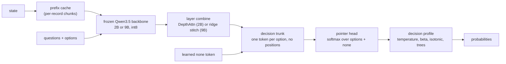

<p align="center">
  
</p>

<p align="center">
  <b>Calibrated typed decisions from open LLMs. No text generation.</b><br>
  State and typed questions in. Probabilities over your options out. Runs locally, down to a Jetson.
</p>

<p align="center">
  
  
  
  
</p>

---

OpenDecider is an open decision model. You send a state (text or JSON) and a set of typed questions. It returns a
calibrated probability for each option. It never writes free text on the decision path.

It is also a public hypothesis test. It rebuilds the observable behavior of TypeSafe's Jev from published methods and
open weights, then measures where the result is consistent or inconsistent with public observations. It makes no
claim about how Jev is built.

```text
state + { route: choice[billing, technical, refund, other], urgent: noul, severity: score[low..critical] }
  └─> { route: {refund: 0.81, billing: 0.12, ...}, urgent: {p_yes: 0.34}, severity: {expected_index: 2.1, ...}, none: 0.03 }
```

## Contents

- [Features](#features)
- [Results](#results)
- [How it works](#how-it-works)
- [Quickstart](#quickstart)
- [API](#api)
- [When to use something else](#when-to-use-something-else)
- [Limitations](#limitations)
- [Roadmap](#roadmap)
- [Reproduce](#reproduce)
- [Project layout](#project-layout)

## Features

| Feature | What it does |
|---|---|
| Typed questions | `choice` (up to 255 options, more with a two-stage shortlist), `noul` (yes/no), `score` (ordinal levels with an expected value). |
| Order invariance | Option order does not change the output. One pass, no permutation averaging. Unit-tested. |
| Portable heads | A head trained on the 2B backbone moves to the 9B backbone with a closed-form ridge map. No gradient steps. |
| Calibration | Trained with cross-entropy plus Brier. `POST /v1/calibrate` fits a per-question profile from your labels and picks the calibrator by cross-validation. |
| `none` sink option | Every question has a learned `none` option. Its probability tells you when no listed option is supported. |
| Prefix cache | States are cached across requests at record boundaries. A state that grows (events, logs) only pays for the new records. |
| Retrieval store | SQLite store with BM25 plus dense search. It builds a state from a large record collection under a token budget. |
| Explanations | Optional `POST /v1/explain`. The same backbone writes a short explanation, cites the records that drove the decision, and scores its own faithfulness. |
| Local | Frozen Qwen3.5 backbone, int8 weights and caches. Reference device: Jetson AGX Orin. |

## Results

All numbers are held-out. Fitted numbers (profiles, trees) are out-of-fold. Brackets are 95% bootstrap intervals.
Full tables: [`docs/RESULTS.md`](docs/RESULTS.md).

### typed-decisions

400 cases, 2,000 decisions, gold is a teacher distribution
([LocalLLaMA/typed-decisions](https://huggingface.co/datasets/LocalLLaMA/typed-decisions), rev `f7a2487edd7a`).

<p align="center"></p>

| Model | Mode | Accuracy | KL ↓ | Brier ↓ |
|---|---|---|---|---|
| meraGPT Decider 1 (proprietary) | leaderboard | 0.768 | 0.096 | 0.052 |
| TypeSafe Jev 1.13 (proprietary) | leaderboard | 0.727 | 1.442 | 0.148 |
| Featherless Simple Jev (35B MoE) | leaderboard | 0.716 | 0.488 | 0.176 |
| OpenDecider tree profile | fitted, 2-fold | **0.675** [0.66, 0.69] | – | **0.113** |
| OpenDecider 2B→9B stitched | zero-shot | **0.616** [0.59, 0.64] | **0.279** | 0.153 |
| OpenDecider 2B | zero-shot | 0.577 | 0.324 | 0.168 |
| Qwen3.5-9B letter scores | zero-shot | 0.573 | 0.899 | 0.344 |

Leaderboard rows are self-reported on the dataset card (read 2026-09-28). Specialist models trained on the benchmark's
own train split score higher (Verdict 2.0: 0.771, Laya: 0.766).

### Public benchmarks

<p align="center"></p>

| | Banking77 (8-way) | Prompt injections | OpenBookQA | CommonsenseQA | PubMedQA |
|---|---|---|---|---|---|
| OpenDecider 2B | 0.819 | 0.767 | 0.686 | 0.639 | 0.849 |
| 2B→9B stitched | 0.856 | 0.595 | 0.838 | 0.764 | 0.837 |
| Qwen3.5-9B zero-shot | 0.931 | 0.819 | 0.894 | 0.813 | 0.883 |
| OpenDecider 2B + 9B profile | **0.956** | **0.931** | 0.890 | 0.800 | **0.887** |
| Jev (third-party report) | 0.838 | 0.870 | 0.942 | 0.881 | – |

### Prefix cache (Jetson AGX Orin, 2B backbone)

A state grows by one record between two requests. The top answer matched the uncached path on every question.

| State tokens | Uncached | With cache | Max probability difference |
|---|---|---|---|
| 883 | 0.98 s | 0.83 s | 0.017 |
| 3,869 | 1.87 s | 0.98 s | 0.026 |
| 15,177 | 6.01 s | 1.69 s | 0.007 |

## How it works



1. The backbone reads the state once. Each question runs as its own branch on the cached state, so adding
   questions adds little latency.
2. Options are tokens, not vocabulary. The head scores any option set the caller sends. Without slot embeddings the
   trunk is permutation-equivariant.
3. The `none` token is a learned vector with no text. It competes with the real options in the same softmax.
4. A decision profile maps raw probabilities to calibrated ones. It can also pool several sources (the trunk, the
   stitched 9B, the 9B's own letter scores).

Design notes: [`docs/roadmap_designs.md`](docs/roadmap_designs.md),
[`docs/branched_shared_prefix_math.md`](docs/branched_shared_prefix_math.md),
[`docs/v3_dense_design.md`](docs/v3_dense_design.md).

## Quickstart

```bash
git clone https://github.com/Minerva-Laboratories/OpenDecider.git
cd OpenDecider
python3.12 -m venv .venv && .venv/bin/pip install -e ".[eval]"

# download the pinned backbone (checks free disk first)
.venv/bin/python -m opendecider.fetch --repo Qwen/Qwen3.5-2B \
    --revision 15852e8c16360a2fea060d615a32b45270f8a8fc --out models/qwen3.5-2b

# serve a trained checkpoint on 127.0.0.1:8000
OPENDECIDER_CKPT=runs/x2b/model.pt .venv/bin/python -m opendecider.api
```

Checkpoints are not in the repository yet. See [Reproduce](#reproduce) to train or stitch one.

## API

```bash
curl -s localhost:8000/v1/decide -H 'content-type: application/json' -d '{
  "state": {"ticket": "I was charged twice for my March invoice and want my money back."},
  "questions": {
    "route":    {"type": "choice", "prompt": "Which team handles this?",
                 "options": ["billing", "technical", {"name": "refund", "description": "customer asks for money back"}, "other"]},
    "urgent":   {"type": "noul",  "prompt": "Does this need a reply within the hour?"},
    "severity": {"type": "score", "prompt": "How severe is it?", "levels": ["low", "medium", "high", "critical"]}
  }
}'
```

| Endpoint | Purpose |
|---|---|
| `POST /v1/decide` | Probabilities for every question. No text generation. |
| `POST /v1/calibrate` | Fit a calibration profile from labeled examples (`method: "auto"` by default). Use it with `"calibration": "<id>"`. |
| `POST /v1/explain` | Optional. Explanation, evidence spans and a faithfulness score for one question. |
| `GET /healthz` | Health check. |

Each answer has `value`, `probs`, `confidence`, and `std` (when `sampler.k > 1`). Models with the sink option also
return `none`. Set `"none": false` on a question to hide it. Invalid requests return 400. Probabilities sum to 1
within 1e-6.

`method: "auto"` compares identity, shrunk temperature, beta, ETS, temperature plus per-option bias, histogram
binning (binary questions) and shrunk isotonic by cross-validated log loss. It keeps the simplest one within one
standard error of the best.

Environment variables:

| Variable | Default | Meaning |
|---|---|---|
| `OPENDECIDER_CKPT` | – | Checkpoint to serve. |
| `OPENDECIDER_STATE_CACHE_MB` | `2048` | Prefix cache size. `0` turns it off. |
| `HOST`, `PORT` | `127.0.0.1`, `8000` | Bind address. |

## When to use something else

| Need | Better fit |
|---|---|
| Under 20 ms per question on one fixed task, with labeled data | A fine-tuned encoder (Laya, Von, Verdict). |
| A 27B+ model is already served and you only need the argmax | A letter-logit wrapper (open-alternative-jev, Featherless). |
| The best zero-shot accuracy today | Decider 1 or Jev (proprietary), or a 27B LoRA model (Kev, Open-Jev). |

A map of about 60 open and commercial alternatives is in [`docs/LANDSCAPE.md`](docs/LANDSCAPE.md).

## Limitations

- Accuracy trails Jev and Decider 1 on typed-decisions.
- The stitched 9B loses accuracy on prompt injections (0.595 vs 0.767 for the 2B).
- Tree profiles overfit below about 250 labels. Use `method: "auto"` and let cross-validation choose.
- Latency is 0.3 to 1.9 s per request on the Orin for states up to about 4k tokens. The TensorRT path is not done.
- There is no Jev API access. All Jev numbers come from TypeSafe or third parties.

## Roadmap

- [x] Prefix cache across requests (exact, per-record chunks).
- [x] Automatic calibrator selection in `/v1/calibrate`.
- [x] `none` sink option (sink-only training done; full training pending).
- [x] Retrieval store (BM25 + dense) and `/v1/explain`.
- [ ] Warm-start 9B training from the stitched checkpoint.
- [ ] Conformal prediction sets and abstention in the API.
- [ ] Consistency constraints across questions.
- [ ] CUDA graphs and TensorRT for p50 < 150 ms on the Orin.

## Reproduce

```bash
.venv/bin/python -m pytest -q                       # CPU unit tests on a tiny random model

# zero-shot LLM baseline through any OpenAI-compatible server with logprobs
.venv/bin/python -m eval.typed_decisions llm --split test --name td-9b --base-url http://127.0.0.1:8080
.venv/bin/python -m eval.typed_decisions od  --split test --name td-x2b --ckpt runs/x2b/model.pt

# stitch the 2B head onto the 9B backbone (closed-form ridge), then evaluate
.venv/bin/python scripts/stitch_backbone.py targets && .venv/bin/python scripts/stitch_backbone.py fit
bash scripts/stitch_eval.sh

# decision profiles and calibration learning curves (out-of-fold)
.venv/bin/python -m eval.tree_head --typed --sources runs/td-x2b runs/td-x9b-stitch runs/td-9b --name tree-typed
.venv/bin/python -m eval.calib_curve --typed --no-trees --sources runs/td-x2b runs/td-x9b-stitch runs/td-9b

# none sink, prefix cache, retrieval recall, explanations
.venv/bin/python scripts/train_none.py --ckpt runs/x2b/model.pt --out runs/x2b-none/model.pt
.venv/bin/python scripts/bench_state_cache.py --ckpt runs/x2b/model.pt
.venv/bin/python -m eval.store_recall --embedder opendecider.embed:x2b_embedder
.venv/bin/python -m eval.explain_eval --ckpt runs/x2b/model.pt
```

Backbone revisions are pinned in `configs/backbone*.yaml`. Dataset sources and licenses are in
[`data/MANIFEST.md`](data/MANIFEST.md).

## Project layout

```text
src/opendecider/   backbone, trunk (v3.py), decider, API, calibration, prefix cache, store, explanations
eval/              benchmarks, probes, profiles, calibration curves, retrieval recall, explanation eval
scripts/           training, stitching, benchmarks
configs/           backbone and model configs (pinned revisions)
data/              dataset builders and MANIFEST.md (licenses)
docs/              results, landscape survey, designs, figures, logo
tests/             CPU unit tests (tiny random Qwen3.5-architecture model)
```

## Background

OpenDecider builds on Pointer Networks, Poly-encoders, Perceiver, Flamingo, iTransformer and RLCR, and on the Qwen3.5
open weights. Jev is a product of TypeSafe. This project is not affiliated with TypeSafe.
