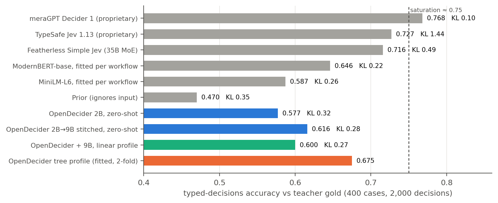
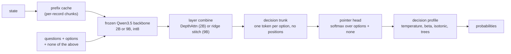

<p align="center">
  
</p>

<p align="center">
  <b>Calibrated typed decisions from open LLMs. No text generation.</b><br>
  State and typed questions in. Probabilities over your options out. Runs locally, down to a Jetson.
</p>

<p align="center">
  
  
  
  
  
</p>

---

OpenDecider is an open decision model. You send a state (text or JSON) and a set of typed questions. It returns a
calibrated probability for each option. It never writes free text on the decision path.

It is also a public hypothesis test. It rebuilds the observable behavior of TypeSafe's Jev from published methods and
open weights, then measures where the result is consistent or inconsistent with public observations. It makes no
claim about how Jev is built.

```text
state + { route: choice[billing, technical, refund, other], urgent: noul, severity: score[low..critical] }
  └─> { route: {refund: 0.81, billing: 0.12, ...}, urgent: {p_yes: 0.34}, severity: {expected_index: 2.1, ...}, none: 0.03 }
```

## Contents

- [Features](#features)
- [Results](#results)
- [How it works](#how-it-works)
- [Requirements](#requirements)
- [Quickstart](#quickstart)
- [API](#api)
- [Limitations](#limitations)
- [Roadmap](#roadmap)
- [Reproduce](#reproduce)
- [Project layout](#project-layout)
- [License](#license)

## Features

| Feature | What it does |
|---|---|
| Typed questions | `choice` (up to 255 options, more with a two-stage shortlist), `noul` (yes/no), `score` (ordinal levels with an expected value). |
| Order invariance | Option order does not change the output. One pass, no permutation averaging. Unit-tested. |
| Portable heads | A head trained on the 2B backbone moves to the 9B backbone with a closed-form ridge map. No gradient steps. |
| Calibration | Trained with cross-entropy plus Brier. `POST /v1/calibrate` fits a per-question profile from your labels and picks the calibrator by cross-validation. |
| `none` option | Every question gets a "none of the above" option that the backbone reads like any other. Its probability tells you when no listed option is supported. |
| Prefix cache | States are cached across requests at record boundaries. A state that grows (events, logs) only pays for the new records. |
| Retrieval store | SQLite store with BM25 plus dense search. It builds a state from a large record collection under a token budget. |
| Explanations | Optional `POST /v1/explain`. The same backbone writes a short explanation, cites the records that drove the decision, and scores its own faithfulness. |
| Local | Frozen Qwen3.5 backbone, int8 weights and caches. Reference device: Jetson AGX Orin. |

## Results

All numbers are held-out. Fitted numbers (profiles, trees) are out-of-fold. Brackets are 95% bootstrap intervals.
Full tables: [`docs/RESULTS.md`](docs/RESULTS.md).

### typed-decisions

400 cases, 2,000 decisions, gold is a teacher distribution
([LocalLLaMA/typed-decisions](https://huggingface.co/datasets/LocalLLaMA/typed-decisions), rev `f7a2487edd7a`).

<p align="center"></p>

| Model | Mode | Accuracy | KL ↓ | Brier ↓ |
|---|---|---|---|---|
| meraGPT Decider 1 (proprietary) | leaderboard | 0.768 | 0.096 | 0.052 |
| TypeSafe Jev 1.13 (proprietary) | leaderboard | 0.727 | 1.442 | 0.148 |
| Featherless Simple Jev (35B MoE) | leaderboard | 0.716 | 0.488 | 0.176 |
| OpenDecider tree profile | fitted, 2-fold | **0.686** [0.67, 0.71] | – | **0.106** |
| OpenDecider 2B→9B stitched | zero-shot | **0.643** [0.62, 0.67] | **0.240** | 0.135 |
| OpenDecider 2B | zero-shot | 0.577 | 0.324 | 0.168 |
| Qwen3.5-9B letter scores | zero-shot | 0.573 | 0.899 | 0.344 |

Leaderboard rows are self-reported on the dataset card (read 2026-09-28). Specialist models trained on the benchmark's
own train split score higher (Verdict 2.0: 0.771, Laya: 0.766).

The gold labels come from a teacher model, so accuracy measures agreement with that teacher, not correctness. The
dataset card gives two ceilings: 0.704 for a model fitted to the factors that generated each case ("perfect scenario
understanding") and 0.735 for the teacher agreeing with itself. It reads about 0.75 as saturation: scores above it
mostly reflect the teacher's quirks.

We do not train on the typed-decisions train split. Its labels are the outputs of a ~4B teacher model on four
synthetic workflows, so fitting them is teacher distillation for one benchmark, and the card itself warns that high
scores reflect the teacher's quirks. The headline numbers are zero-shot. The tree-profile row is the only one fitted to
benchmark labels (out-of-fold, a few hundred parameters); it shows what a per-customer decision profile does with
labeled data, and is not a zero-shot result.

### Public benchmarks

<p align="center"></p>

| | Banking77 (8-way) | Prompt-injection detection | OpenBookQA | CommonsenseQA | PubMedQA |
|---|---|---|---|---|---|
| OpenDecider 2B | 0.819 | 0.767 | 0.686 | 0.639 | 0.849 |
| 2B→9B stitched | 0.869 | 0.750 | 0.850 | 0.785 | **0.898** |
| Qwen3.5-9B zero-shot | 0.931 | 0.819 | 0.894 | 0.813 | 0.883 |
| OpenDecider 2B + 9B profile | **0.956** | **0.931** | 0.890 | 0.800 | 0.887 |
| OpenDecider stitched 9B + 9B profile | 0.950 | 0.897 | **0.900** | 0.810 | **0.899** |
| Jev (third-party report) | 0.838 | 0.870 | 0.942 | 0.881 | – |

All values are accuracy. Prompt-injection detection is a classification task
([deepset/prompt-injections](https://huggingface.co/datasets/deepset/prompt-injections), 116 held-out texts): the
model labels each text as an injection attempt or a normal request. 0.931 means 93.1% of those texts got the right
label; the errors include both missed injections and false alarms. It does not measure whether the model itself
resists injected instructions inside a state. That is a separate test and not done yet.

### `none` option (no extra training)

Held-out questions from the training families (clinc, massive, dbpedia, arc, snli), plus questions paired with an
unrelated state. AUROC measures how well P(none) separates unanswerable from answerable questions.

| Case | 2B: mean P(none) | 2B: AUROC | 9B stitched: mean P(none) | 9B stitched: AUROC |
|---|---|---|---|---|
| Answerable (correct option listed) | 0.097 | – | 0.021 | – |
| Correct option removed | 0.430 | 0.845 | 0.301 | 0.945 |
| State unrelated to the question | 0.151 | 0.795 | 0.095 | 0.925 |

Accuracy on answerable questions: 0.892 (2B), 0.916 (9B). A learned `none` vector with only its two parameters trained
did worse (unrelated-state AUROC 0.537). See [`docs/roadmap_designs.md`](docs/roadmap_designs.md).

### Memory and quantization (Jetson AGX Orin, 2B backbone, no retraining)

The model was trained with int8 weights and an int8 cache. Memory and latency come from one fresh process per
config. Accuracy: 500 typed-decisions questions (first 100 test cases), Banking77 8-way (160), prompt-injection
detection (116).

| Weights / cache | Weight memory | Peak GPU memory, 0.8k / 3.7k / 15k-token state | Latency, same states | Stored state, 15k tokens | typed-decisions | Banking77 | Injection detection |
|---|---|---|---|---|---|---|---|
| int8 / int8 (default) | 1.88 GB | 2.4 / 2.5 / 3.1 GB | 0.86 / 1.58 / 4.92 s | 106 MB | 0.434 | 0.825 | 0.776 |
| int8 / int4 | 1.88 GB | 2.4 / 2.5 / 3.1 GB | 0.81 / 1.47 / 4.60 s | 67 MB | 0.446 | 0.819 | 0.767 |
| NF4 / int8 | 1.26 GB | 1.8 / 1.8 / 2.5 GB | 0.64 / 1.33 / 4.43 s | 106 MB | 0.404 | 0.756 | 0.707 |
| NF4 / int4 | 1.26 GB | 1.8 / 1.8 / 2.5 GB | 0.64 / 1.29 / 4.38 s | 67 MB | 0.410 | 0.781 | 0.698 |

- Option rows attend to one shared copy of the state's K/V through fused SDPA (memory-efficient kernel, scores never
  materialized) instead of each row getting its own full-precision copy. Before this, peak memory at 15k tokens was
  7.7 GB (int8) and 7.0 GB (NF4 / int4).
- A 4-bit cache is safe: accuracy stays within noise. The stored state is small
  either way because the backbone has only 6 attention layers with 2 KV heads; the fixed-size GDN recurrent state
  stays bf16.
- 4-bit weights (NF4) save 0.6 GB and 10 to 26% latency (more on short states), but cost 4 to 8 points on the public sets.
  Retraining the head on NF4 features may recover part of that.
- The remaining growth with state length is the one-time activations of the state pass. Chunked prefill would
  reduce it.

Set `weight_quant: nf4` and `kv_quant: int4` in `configs/backbone*.yaml`. Script: `scripts/bench_quant.py`.

### Explanations (`/v1/explain`, 2B backbone, 24 typed-decisions cases)

The decision model re-reads only the explanation, with every option name masked, and tries to reach the same decision.

| Check | Value |
|---|---|
| Decision recovered from the explanation alone (greedy) | 83% (mismatched explanation: 29%) |
| P(decision) from the explanation alone, greedy / best of 4 | 0.67 / 0.88 (mismatched: 0.30, empty: 0.28) |
| Drop in P(decision) when the top cited record is removed | 0.25 (mean P(decision): 0.51) |
| Latency per greedy explanation, Orin | 16.5 s median (eager generation, not optimized) |

### Prefix cache (Jetson AGX Orin, 2B backbone)

A state grows by one record between two requests. The top answer matched the uncached path on every question.

| State tokens | Uncached | With cache | Max probability difference |
|---|---|---|---|
| 883 | 0.98 s | 0.83 s | 0.017 |
| 3,869 | 1.87 s | 0.98 s | 0.026 |
| 15,177 | 6.01 s | 1.69 s | 0.007 |

## How it works



1. The backbone reads the state once. Each question runs as its own branch on the cached state, so adding
   questions adds little latency.
2. Options are tokens, not vocabulary. The head scores any option set the caller sends. Without slot embeddings the
   trunk is permutation-equivariant.
3. "none of the above" is added to every question as a normal option. It competes with the real options in the same
   softmax. `probs` is renormalized over your options, and `none` is reported next to it.
4. A decision profile maps raw probabilities to calibrated ones. It can also pool several sources (the trunk, the
   stitched 9B, the 9B's own letter scores).

Design notes: [`docs/roadmap_designs.md`](docs/roadmap_designs.md),
[`docs/branched_shared_prefix_math.md`](docs/branched_shared_prefix_math.md),
[`docs/v3_dense_design.md`](docs/v3_dense_design.md).

## Requirements

| | Minimum | Tested |
|---|---|---|
| GPU memory, 2B backbone | 2.4 GB for states up to about 1k tokens, 2.5 GB up to 4k, 3.1 GB up to 15k (int8 weights: 1.9 GB). With 4-bit weights and cache: 1.8 / 1.8 / 2.5 GB | Jetson AGX Orin 64 GB (inference), DGX Spark (training) |
| GPU memory, 9B backbone | 9.8 GB for states up to about 1k tokens, 9.9 GB up to 4k, 11.0 GB up to 15k (int8 weights: 8.6 GB) | Jetson AGX Orin 64 GB |
| Host RAM | 12 GB peak while loading the 2B backbone | same |
| Disk, 2B backbone | 4.3 GB weights + about 0.1 GB checkpoint | same |
| Disk, 9B backbone (stitched) | 5.2 GB Q4_0 GGUF (loaded directly, see `src/opendecider/gguf_load.py`) + 0.23 GB checkpoint | same |
| Disk, Python environment | about 6 GB (PyTorch, transformers) | same |
| Python | 3.12 | 3.12 on aarch64 (JetPack) |
| CPU only | Unit tests only (tiny random model) | – |

Weights are loaded as int8 (or NF4, see [Memory and quantization](#memory-and-quantization-jetson-agx-orin-2b-backbone-no-retraining)), so GPU memory is lower
than the bf16 download size. The prefix cache adds up to
`OPENDECIDER_STATE_CACHE_MB` (default 2 GB). The code keeps at least 4 GB of disk
free and refuses downloads that would go below that.

## Quickstart

```bash
git clone https://github.com/Minerva-Laboratories/OpenDecider.git
cd OpenDecider
python3.12 -m venv .venv && .venv/bin/pip install -e ".[gguf,quant]"

# run the 2B checkpoint in-process (downloads the pinned Qwen3.5-2B backbone, 4.3 GB, on first run)
.venv/bin/python examples/quickstart.py

# or serve it on 127.0.0.1:8000 and send a request
.venv/bin/python -m opendecider.serve --model checkpoints/opendecider-2b &
bash examples/request.sh
```

Output of the quickstart from a fresh clone (2B, int8 backbone, Jetson AGX Orin):

```text
route     -> billing    (billing: 0.70, technical: 0.00, refund: 0.30, other: 0.00)  none: 0.00
urgent    -> yes        (yes: 0.80, no: 0.20)  none: 0.04
severity  -> high       (low: 0.03, medium: 0.29, high: 0.58, critical: 0.10)  none: 0.01
```

The first call includes one-time warm-up (about 4.5 s on the Orin); later calls on a state this size take about
0.8 s.

Backbones are cached under `models/` (or `$OPENDECIDER_MODELS`). Every download checks that at least 4 GB of disk
stays free. Without a CUDA GPU the `int8` variant runs on CPU with reference kernels (slow).

## Checkpoints

Both checkpoints are in this repository under `checkpoints/` (fp16 safetensors, shards under 50 MB, no Git LFS).
They contain only what was trained; the frozen backbone is downloaded from its original repository at a pinned
revision. Each folder has a model card (`README.md`) with results and data licenses.

| Checkpoint | Trained part | Backbone variants (`backbone=`) | Zero-shot typed-decisions |
|---|---|---|---|
| `checkpoints/opendecider-2b` | 25.4M parameters, 48 MB | `int8` (default), `w8`, `nf4`, `awq` | 0.577 |
| `checkpoints/opendecider-9b-stitched` | 57.3M parameters, 109 MB | `gguf-q4_0` (default), `int8` | 0.643 |

```python
from opendecider.hub import load_decider
dec = load_decider("checkpoints/opendecider-9b-stitched")    # Q4_0 GGUF backbone from unsloth/Qwen3.5-9B-MTP-GGUF
dec = load_decider("checkpoints/opendecider-2b", backbone="awq", kv_quant="int4")
```

4-bit backbone variants (`awq`, `nf4`) lose 4 to 8 points on the public sets: the head was trained on int8 features.

## API

```bash
curl -s localhost:8000/v1/decide -H 'content-type: application/json' -d '{
  "state": {"ticket": "I was charged twice for my March invoice and want my money back."},
  "questions": {
    "route":    {"type": "choice", "prompt": "Which team handles this?",
                 "options": ["billing", "technical", {"name": "refund", "description": "customer asks for money back"}, "other"]},
    "urgent":   {"type": "noul",  "prompt": "Does this need a reply within the hour?"},
    "severity": {"type": "score", "prompt": "How severe is it?", "levels": ["low", "medium", "high", "critical"]}
  }
}'
```

| Endpoint | Purpose |
|---|---|
| `POST /v1/decide` | Probabilities for every question. No text generation. |
| `POST /v1/calibrate` | Fit a calibration profile from labeled examples (`method: "auto"` by default). Use it with `"calibration": "<id>"`. |
| `POST /v1/explain` | Optional. Explanation, evidence spans and a faithfulness score for one question. |
| `GET /healthz` | Health check. |

Each answer has `value`, `probs`, `confidence`, and `std` (when `sampler.k > 1`). Each answer also has `none`, the
probability that no listed option is supported. Set `"none": false` on a question to turn it off. Invalid requests return 400. Probabilities sum to 1
within 1e-6.

`method: "auto"` compares identity, shrunk temperature, beta, ETS, temperature plus per-option bias, histogram
binning (binary questions) and shrunk isotonic by cross-validated log loss. It keeps the simplest one within one
standard error of the best.

Environment variables:

| Variable | Default | Meaning |
|---|---|---|
| `OPENDECIDER_CKPT` | – | Run checkpoint (`runs/*/model.pt`) for `python -m opendecider.api`. Released checkpoints use `python -m opendecider.serve --model`. |
| `OPENDECIDER_MODELS` | `models` | Backbone download cache. |
| `OPENDECIDER_STATE_CACHE_MB` | `2048` | Prefix cache size. `0` turns it off. |
| `OPENDECIDER_NONE_TEXT` | `none of the above` | Text of the `none` option. Empty turns it off. |
| `HOST`, `PORT` | `127.0.0.1`, `8000` | Bind address. |

## Limitations

### Known limitations

- Accuracy trails Jev and Decider 1 on typed-decisions (zero-shot 0.616 vs 0.727 and 0.768).
- The stitched 9B is slightly below the 2B on prompt-injection detection (0.750 vs 0.767).
- 4-bit weights cost 4 to 8 points on the public sets with every method tried, AWQ included, because the head was
  trained on int8 features. Retraining the head on 4-bit features is the planned fix.
- Tree profiles overfit below about 250 labels. Use `method: "auto"` and let cross-validation choose.
- Latency is 0.8 to 1.5 s per request on the Orin (2B) for states up to about 4k tokens, and 4.6 s at 15k. The
  passes are compute-bound: CUDA graphs were measured and made it slower (`docs/RESULTS.md` §12). The levers are
  fewer FLOPs (question cache, prefix cache, retrieval) and faster quantized GEMMs.
- Explanations take about 16 s (2B) and 75 s (9B) each on the Orin (eager decoding) and can contain small factual
  slips.
- The prefix cache matches the uncached path to within 0.007 to 0.026 in probability (int8 cache boundaries), not
  bit-exactly.
- Dense retrieval uses mean-pooled backbone states, which is a weak retriever. BM25 is the default.
- There is no Jev API access. All Jev numbers come from TypeSafe or third parties.
- Checkpoints are not published yet.

### Not measured yet

Everything below is either running or planned. Results will be added here and in [`docs/RESULTS.md`](docs/RESULTS.md).

| Area | Status |
|---|---|
| W8A8 without the accuracy loss (SmoothQuant-style calibration) | Planned. W8A8 is 2.5x faster on the 9B at 0.8k tokens but loses 5 to 6 points; see `docs/RESULTS.md` §12. |
| 9B AWQ | Needs ~8.5 GB of disk; planned on another machine. |
| 9B training (warm start from the stitched head) | Planned, on a separate training machine. |
| GPUs other than the Jetson AGX Orin (desktop and data-center cards, DGX Spark inference) | Planned. All memory and latency numbers are from one Orin 64 GB. |
| GPU tests in CI | Planned. Unit tests run on CPU with a tiny random model; one GPU test covers the fused attention path. |
| Confidence intervals for the quantization and explanation tables | Planned. Those tables use single runs on subsets (500 + 276 questions, 24 cases). |
| `none` option on out-of-distribution sets and hard negatives | Planned. Current numbers use held-out questions from the training families. |
| Robustness to prompt injection inside a state (not detection) | Planned. |
| Behavioral probe battery on Jev itself | Blocked on API access. |
| Retrieval store inside `/v1/decide`, and a dedicated embedding model | Planned. The store is a library with a synthetic recall benchmark. |
| Explanations: optimized decoding (state reused from the prefix cache, quantized LM-head GEMM, CUDA-graph decode step) and human review | Planned, after the kernel follow-ups. Current: 16 s (2B) and 75 s (9B) per explanation. |
| More than 255 options (two-stage path) at scale | Planned. Implemented and unit-tested, not benchmarked. |
| Languages other than English | Planned. |

## Roadmap

- [x] Prefix cache across requests (exact, per-record chunks).
- [x] Automatic calibrator selection in `/v1/calibrate`.
- [x] `none` option ("none of the above", no training needed).
- [x] Retrieval store (BM25 + dense) and `/v1/explain`.
- [x] Released checkpoints (2B, 9B stitched) with pinned backbone variants.
- [ ] Warm-start 9B training from the stitched checkpoint.
- [ ] Conformal prediction sets and abstention in the API.
- [ ] Consistency constraints across questions.
- [ ] CUDA graphs and TensorRT for p50 < 150 ms on the Orin.

## Reproduce

```bash
.venv/bin/python -m pytest -q                       # CPU unit tests on a tiny random model

# zero-shot LLM baseline through any OpenAI-compatible server with logprobs
.venv/bin/python -m eval.typed_decisions llm --split test --name td-9b --base-url http://127.0.0.1:8080
.venv/bin/python -m eval.typed_decisions od  --split test --name td-x2b --ckpt runs/x2b/model.pt

# stitch the 2B head onto the 9B backbone (closed-form ridge), then evaluate
.venv/bin/python scripts/stitch_backbone.py targets && .venv/bin/python scripts/stitch_backbone.py fit
bash scripts/stitch_eval.sh

# decision profiles and calibration learning curves (out-of-fold)
.venv/bin/python -m eval.tree_head --typed --sources runs/td-x2b runs/td-x9b-stitch runs/td-9b --name tree-typed
.venv/bin/python -m eval.calib_curve --typed --no-trees --sources runs/td-x2b runs/td-x9b-stitch runs/td-9b

# none option (explicit text; the learned-vector variant trains with --out), prefix cache, recall, explanations
.venv/bin/python scripts/train_none.py --ckpt runs/x2b/model.pt --explicit "none of the above"
.venv/bin/python scripts/bench_state_cache.py --ckpt runs/x2b/model.pt
.venv/bin/python -m eval.store_recall --embedder opendecider.embed:x2b_embedder
.venv/bin/python -m eval.explain_eval --ckpt runs/x2b/model.pt
```

Backbone revisions are pinned in `configs/backbone*.yaml`. Dataset sources and licenses are in
[`data/MANIFEST.md`](data/MANIFEST.md).

## Project layout

```text
src/opendecider/   backbone, trunk (v3.py), decider, API, calibration, prefix cache, store, explanations
eval/              benchmarks, probes, profiles, calibration curves, retrieval recall, explanation eval
scripts/           training, stitching, benchmarks
configs/           backbone and model configs (pinned revisions)
data/              dataset builders and MANIFEST.md (licenses)
docs/              results, landscape survey, designs, figures, logo
tests/             CPU unit tests (tiny random Qwen3.5-architecture model)
checkpoints/       released heads (safetensors + config + model card)
examples/          quickstart.py, request.sh
```

## Background

OpenDecider builds on Pointer Networks, Poly-encoders, Perceiver, Flamingo, iTransformer and RLCR, and on the Qwen3.5
open weights. A survey of related open and commercial projects is in [`docs/LANDSCAPE.md`](docs/LANDSCAPE.md).
Jev is a product of TypeSafe. This project is not affiliated with TypeSafe.

## License

Code and released checkpoint weights: [Apache-2.0](LICENSE). See [`NOTICE`](NOTICE).
The backbones (Qwen3.5 and the listed quantizations) are Apache-2.0 and are downloaded from their own repositories.
The heads were trained on datasets listed with their licenses in [`data/MANIFEST.md`](data/MANIFEST.md) and in each
model card. Four of them are CC-BY-SA; whether trained weights count as adapted material under share-alike terms is
legally unsettled (the heads are classifiers and do not generate text). These checkpoints will be retrained without the CC-BY-SA datasets and re-released with clean provenance.
