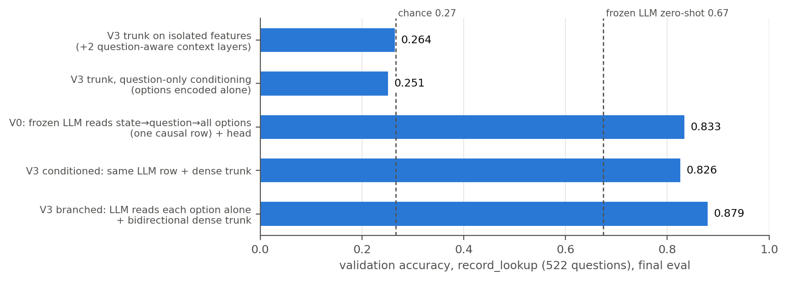
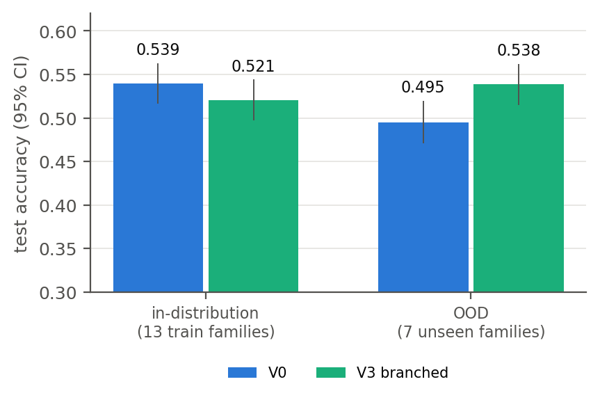
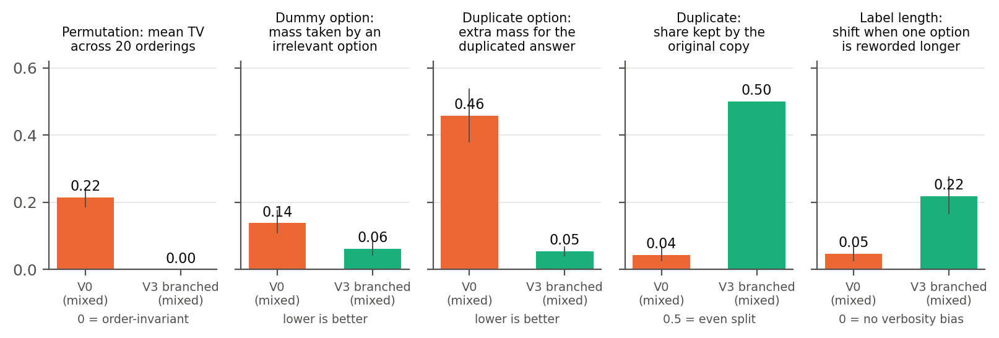
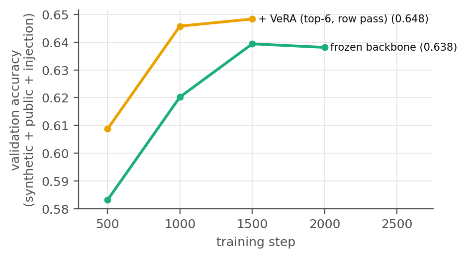

# OpenDecider: detailed results

## Conventions

- Sources: `runs/*/eval_*.json`, `runs/*/ensemble_cv.json` and `runs/tree-*/tree_head.json`. The run directories
  are gitignored. The README section *Reproduce* lists the commands that produce them.
- Brackets are 95% bootstrap confidence intervals (CIs) with 1,000 resamples. Exception: the OpenDecider 2B public
  evaluation used 200 resamples.
- Fitted heads (decision profiles, trees) are out-of-fold. Each item is predicted by a model fitted on the other
  half of the data, split by question group (2-fold cross-fit).
- This is a hypothesis test. Comparisons with Jev state only whether a result is consistent or inconsistent with
  public observations.

## 1. Models

| Name | What it is |
|---|---|
| OpenDecider 2B (`runs/x2b`) | V3 branched model: frozen Qwen3.5-2B (int8), VeRA adapters, DepthAttn layer combine, 512-wide trunk, CLS pointer head, trained with CE + Brier on permissive public and synthetic data (`data/MANIFEST.md`) |
| 2B→9B stitched (`runs/x9b-stitch`) | The same trunk and head (119 tensors reused) on frozen Qwen3.5-9B (rev c202236235762e1c871ad0ccb60c8ee5ba337b9a). A ridge map from unit-normalized 9B layers 8/16/24/final to the 2B's combined features replaces the layer combine. λ=1, held-out cosine 0.895, fitted on 205,529 tokens from 900 training states. No gradient steps. |
| Qwen3.5-9B zero-shot | The same 9B (Q4_0 GGUF, llama.cpp server). Options are rendered as letters, and letter log-probs are renormalized over the options (`eval/zeroshot_llm.py`) |
| Profile (linear) | `p ∝ exp(Σ_s w_s log p_s)`, with a per-option bias only when every question in the split has the same option set (`eval/ensemble_cv.py`) |
| Profile (GBDT / forest) | LightGBM over per-option features from each source (log p, rank, gap to the best option, entropy, K), per-question softmax, then one temperature (`eval/tree_head.py`) |

## 2. Public benchmarks

| Split | Model | n | Accuracy | NLL | ECE | AUROC |
|---|---|---|---|---|---|---|
| banking77_8way | OpenDecider 2B | 160 | 0.819 [0.762, 0.869] | 0.943 | 0.126 | 0.673 |
| banking77_8way | 2B→9B stitched | 160 | 0.856 [0.800, 0.906] | 0.576 | 0.158 | 0.909 |
| banking77_8way | Qwen3.5-9B zero-shot | 160 | 0.931 [0.887, 0.969] | 0.235 | 0.029 | 0.888 |
| banking77_8way | 2B + 9B profile (linear) | 160 | 0.956 [0.925, 0.988] | 0.171 | 0.029 | 0.884 |
| banking77_8way | stitched + 9B profile (linear) | 160 | 0.950 [0.912, 0.981] | 0.179 | 0.019 | 0.902 |
| prompt_injections | OpenDecider 2B | 116 | 0.767 [0.689, 0.845] | 0.838 | 0.174 | 0.625 |
| prompt_injections | 2B→9B stitched | 116 | 0.595 [0.500, 0.672] | 0.770 | 0.275 | 0.784 |
| prompt_injections | Qwen3.5-9B zero-shot | 116 | 0.819 [0.750, 0.888] | 0.400 | 0.093 | 0.798 |
| prompt_injections | 2B + 9B profile (linear) | 116 | 0.931 [0.879, 0.974] | 0.245 | 0.069 | 0.726 |
| prompt_injections | stitched + 9B profile (linear) | 116 | 0.888 [0.828, 0.940] | 0.284 | 0.112 | 0.797 |
| openbookqa | OpenDecider 2B | 500 | 0.686 [0.646, 0.724] | 0.875 | 0.075 | 0.759 |
| openbookqa | 2B→9B stitched | 500 | 0.838 [0.806, 0.868] | 0.589 | 0.196 | 0.847 |
| openbookqa | Qwen3.5-9B zero-shot | 500 | 0.894 [0.866, 0.920] | 0.319 | 0.026 | 0.890 |
| openbookqa | 2B + 9B profile (linear) | 500 | 0.890 [0.864, 0.916] | 0.322 | 0.029 | 0.893 |
| openbookqa | stitched + 9B profile (linear) | 500 | 0.894 [0.868, 0.920] | 0.301 | 0.024 | 0.901 |
| commonsenseqa | OpenDecider 2B | 1000 | 0.639 [0.608, 0.665] | 1.046 | 0.168 | 0.781 |
| commonsenseqa | 2B→9B stitched | 1000 | 0.764 [0.738, 0.789] | 0.710 | 0.140 | 0.794 |
| commonsenseqa | Qwen3.5-9B zero-shot | 1000 | 0.813 [0.787, 0.837] | 0.578 | 0.046 | 0.800 |
| commonsenseqa | 2B + 9B profile (linear) | 1000 | 0.800 [0.776, 0.823] | 0.555 | 0.029 | 0.820 |
| commonsenseqa | stitched + 9B profile (linear) | 1000 | 0.812 [0.788, 0.836] | 0.529 | 0.039 | 0.810 |
| pubmedqa | OpenDecider 2B | 890 | 0.849 [0.827, 0.874] | 0.392 | 0.067 | 0.781 |
| pubmedqa | 2B→9B stitched | 890 | 0.837 [0.811, 0.861] | 0.415 | 0.069 | 0.711 |
| pubmedqa | Qwen3.5-9B zero-shot | 890 | 0.883 [0.863, 0.903] | 0.281 | 0.016 | 0.832 |
| pubmedqa | 2B + 9B profile (linear) | 890 | 0.887 [0.865, 0.906] | 0.274 | 0.029 | 0.835 |
| pubmedqa | stitched + 9B profile (linear) | 890 | 0.893 [0.873, 0.912] | 0.268 | 0.019 | 0.827 |

Jev accuracy from a third-party report (not reproduced here): Banking77 8-way 0.838, prompt injections 0.870,
OpenBookQA 0.942, CommonsenseQA 0.881.

Observations:
- Stitching gains on the knowledge-heavy sets: +15 points on OpenBookQA and +12.5 on CommonsenseQA.
- Stitching loses 17 points on prompt injections. The linear map does not preserve every feature the 2B trunk uses.
- The 9B zero-shot model is well calibrated alone (ECE 0.016–0.093).
- The profile helps most where the two sources disagree in useful ways (Banking77, prompt injections).

## 3. typed-decisions

Dataset: LocalLLaMA/typed-decisions, Apache-2.0, rev f7a2487edd7a.

- 400 test cases × 5 typed questions = 2,000 decisions.
- Gold is the mean of three samples from a ~4B teacher, so gold is a distribution.
- Accuracy compares the predicted argmax with the gold argmax.
- KL is KL(gold ‖ pred). Brier is measured against the gold distribution.
- All models are zero-shot on these workflows unless marked as fitted.

| Model | Accuracy | KL | Brier | Log loss | ECE |
|---|---|---|---|---|---|
| OpenDecider 2B | 0.577 | 0.324 | 0.168 | 1.092 | 0.035 |
| 2B→9B stitched | 0.616 [0.593, 0.639] | 0.279 [0.264, 0.294] | 0.153 [0.143, 0.162] | 1.046 | 0.146 |
| Qwen3.5-9B zero-shot | 0.573 [0.548, 0.601] | 0.899 [0.860, 0.940] | 0.344 [0.328, 0.361] | 1.666 | 0.225 |
| 2B + 9B linear profile (weights fitted on 500 train decisions) | 0.600 | 0.271 | 0.145 | — | — |
| stitched + 9B linear profile (weights fitted on 500 train decisions) | 0.618 [0.594, 0.641] | 0.302 | 0.163 | 1.069 | 0.188 |

CIs in this table resample cases. The two "train decisions" profiles take their weights from the first 100 training
cases. The file is sorted, so all 100 come from one workflow (agent_trace). Treat these rows as a conservative lower
bound. The 2-fold profiles in §4 do not have this problem.

Accuracy per workflow, stitched vs 9B zero-shot (500 decisions each):

| Workflow | Stitched | 9B zero-shot |
|---|---|---|
| agent_trace_observability | 0.502 | 0.436 |
| customer_service | 0.696 | 0.606 |
| invoice_processing | 0.614 | 0.598 |
| security_incidents | 0.650 | 0.652 |

Leaderboard (self-reported on the dataset card, read 2026-09-28):

| Model | Accuracy | KL | Brier |
|---|---|---|---|
| meraGPT Decider 1 | 0.768 | 0.096 | 0.052 |
| TypeSafe Jev 1.13 | 0.727 | 1.442 | 0.148 |
| Featherless Simple Jev (35B MoE) | 0.716 | 0.488 | 0.176 |
| ModernBERT-base, fitted per workflow | 0.646 | 0.223 | 0.119 |
| MiniLM-L6, fitted per workflow | 0.587 | 0.262 | 0.143 |
| Prior | 0.470 | 0.347 | 0.189 |

## 4. Decision profiles: linear vs gradient-boosted trees vs random forest

Question: can a tree ensemble on top of the LLM replace or improve the neural or linear head?

- `src0`, `src1` and `src2` are the individual sources, in input order.
- For tree-public and tree-typed the order is 2B, stitched, 9B zero-shot.
- The `*-llm` runs use the 9B zero-shot model alone.
- CIs here resample individual decisions. The typed-decisions CIs are therefore somewhat narrower than case-level CIs.

### tree-public

| Split | Head | Accuracy | Log loss | Brier | ECE |
|---|---|---|---|---|---|
| banking77_8way | src0 | 0.819 [0.756, 0.875] | 0.943 | 0.341 | 0.126 |
| banking77_8way | src1 | 0.856 [0.800, 0.906] | 0.576 | 0.226 | 0.158 |
| banking77_8way | src2 | 0.931 [0.887, 0.969] | 0.235 | 0.111 | 0.029 |
| banking77_8way | linear | 0.931 [0.887, 0.969] | 0.236 | 0.113 | 0.030 |
| banking77_8way | gbdt | 0.938 [0.894, 0.975] | 0.533 | 0.113 | 0.045 |
| banking77_8way | forest | 0.931 [0.887, 0.969] | 0.296 | 0.117 | 0.060 |
| commonsenseqa | src0 | 0.639 [0.608, 0.669] | 1.046 | 0.506 | 0.168 |
| commonsenseqa | src1 | 0.764 [0.738, 0.790] | 0.710 | 0.357 | 0.140 |
| commonsenseqa | src2 | 0.813 [0.790, 0.836] | 0.578 | 0.284 | 0.046 |
| commonsenseqa | linear | 0.811 [0.788, 0.835] | 0.531 | 0.273 | 0.022 |
| commonsenseqa | gbdt | 0.807 [0.783, 0.829] | 0.881 | 0.320 | 0.124 |
| commonsenseqa | forest | 0.807 [0.783, 0.831] | 0.590 | 0.291 | 0.061 |
| openbookqa | src0 | 0.686 [0.646, 0.724] | 0.875 | 0.442 | 0.075 |
| openbookqa | src1 | 0.838 [0.806, 0.870] | 0.589 | 0.289 | 0.196 |
| openbookqa | src2 | 0.894 [0.868, 0.920] | 0.319 | 0.157 | 0.026 |
| openbookqa | linear | 0.900 [0.874, 0.926] | 0.298 | 0.147 | 0.026 |
| openbookqa | gbdt | 0.886 [0.860, 0.914] | 2.107 | 0.222 | 0.112 |
| openbookqa | forest | 0.896 [0.870, 0.922] | 0.357 | 0.166 | 0.062 |
| prompt_injections | src0 | 0.767 [0.681, 0.845] | 0.838 | 0.381 | 0.174 |
| prompt_injections | src1 | 0.595 [0.500, 0.681] | 0.770 | 0.537 | 0.275 |
| prompt_injections | src2 | 0.819 [0.750, 0.888] | 0.400 | 0.258 | 0.093 |
| prompt_injections | linear | 0.819 [0.750, 0.888] | 0.384 | 0.250 | 0.114 |
| prompt_injections | gbdt | 0.879 [0.819, 0.931] | 1.833 | 0.236 | 0.113 |
| prompt_injections | forest | 0.819 [0.750, 0.888] | 0.429 | 0.277 | 0.173 |
| pubmedqa | src0 | 0.849 [0.827, 0.872] | 0.392 | 0.230 | 0.067 |
| pubmedqa | src1 | 0.837 [0.813, 0.862] | 0.415 | 0.258 | 0.069 |
| pubmedqa | src2 | 0.883 [0.862, 0.902] | 0.281 | 0.169 | 0.016 |
| pubmedqa | linear | 0.885 [0.863, 0.905] | 0.277 | 0.165 | 0.022 |
| pubmedqa | gbdt | 0.874 [0.852, 0.894] | 1.015 | 0.232 | 0.104 |
| pubmedqa | forest | 0.881 [0.861, 0.901] | 0.309 | 0.178 | 0.040 |

### tree-public-llm

| Split | Head | Accuracy | Log loss | Brier | ECE |
|---|---|---|---|---|---|
| banking77_8way | src0 | 0.931 [0.887, 0.969] | 0.235 | 0.111 | 0.029 |
| banking77_8way | linear | 0.931 [0.887, 0.969] | 0.236 | 0.113 | 0.030 |
| banking77_8way | gbdt | 0.894 [0.838, 0.938] | 1.480 | 0.203 | 0.100 |
| banking77_8way | forest | 0.931 [0.887, 0.969] | 0.290 | 0.118 | 0.058 |
| commonsenseqa | src0 | 0.813 [0.790, 0.836] | 0.578 | 0.284 | 0.046 |
| commonsenseqa | linear | 0.813 [0.790, 0.836] | 0.563 | 0.281 | 0.042 |
| commonsenseqa | gbdt | 0.801 [0.776, 0.826] | 0.673 | 0.302 | 0.068 |
| commonsenseqa | forest | 0.811 [0.788, 0.834] | 0.610 | 0.296 | 0.064 |
| openbookqa | src0 | 0.894 [0.868, 0.920] | 0.319 | 0.157 | 0.026 |
| openbookqa | linear | 0.894 [0.868, 0.920] | 0.318 | 0.157 | 0.023 |
| openbookqa | gbdt | 0.872 [0.844, 0.900] | 1.027 | 0.216 | 0.099 |
| openbookqa | forest | 0.892 [0.866, 0.918] | 0.375 | 0.171 | 0.063 |
| prompt_injections | src0 | 0.819 [0.750, 0.888] | 0.400 | 0.258 | 0.093 |
| prompt_injections | linear | 0.819 [0.750, 0.888] | 0.384 | 0.250 | 0.114 |
| prompt_injections | gbdt | 0.793 [0.716, 0.862] | 0.447 | 0.273 | 0.111 |
| prompt_injections | forest | 0.828 [0.759, 0.888] | 0.428 | 0.277 | 0.145 |
| pubmedqa | src0 | 0.883 [0.862, 0.902] | 0.281 | 0.169 | 0.016 |
| pubmedqa | linear | 0.883 [0.862, 0.902] | 0.284 | 0.169 | 0.023 |
| pubmedqa | gbdt | 0.855 [0.831, 0.876] | 0.413 | 0.205 | 0.064 |
| pubmedqa | forest | 0.869 [0.845, 0.889] | 0.315 | 0.182 | 0.043 |

### tree-typed

| Split | Head | Accuracy | Log loss | Brier | ECE |
|---|---|---|---|---|---|
| typed_decisions | src0 | 0.578 [0.556, 0.602] | 1.092 | 0.168 | 0.037 |
| typed_decisions | src1 | 0.615 [0.596, 0.634] | 1.046 | 0.153 | 0.145 |
| typed_decisions | src2 | 0.571 [0.549, 0.591] | 1.666 | 0.344 | 0.228 |
| typed_decisions | linear | 0.618 [0.598, 0.638] | 1.012 | 0.135 | 0.085 |
| typed_decisions | gbdt | 0.675 [0.655, 0.695] | 0.973 | 0.113 | 0.089 |
| typed_decisions | forest | 0.653 [0.634, 0.672] | 1.006 | 0.127 | 0.084 |

### tree-typed-llm

| Split | Head | Accuracy | Log loss | Brier | ECE |
|---|---|---|---|---|---|
| typed_decisions | src0 | 0.571 [0.549, 0.591] | 1.666 | 0.344 | 0.228 |
| typed_decisions | linear | 0.571 [0.549, 0.591] | 1.084 | 0.171 | 0.096 |
| typed_decisions | gbdt | 0.566 [0.544, 0.587] | 1.057 | 0.160 | 0.052 |
| typed_decisions | forest | 0.576 [0.555, 0.597] | 1.068 | 0.163 | 0.067 |

### Findings

- Trees on the LLM alone add no accuracy on typed-decisions (0.566–0.576 vs 0.571). They do repair its calibration
  (Brier 0.344 → 0.160, ECE 0.228 → 0.052). A single temperature or a linear profile gets most of that gain.
- Trees over several heterogeneous sources are the best head on typed-decisions. GBDT reaches 0.675 accuracy and
  Brier 0.113. The linear profile reaches 0.618 and 0.135. The best single source (stitched) reaches 0.615.
- Trees can learn interactions such as "trust the 9B when its entropy is low, else the trunk". A log-linear pool
  cannot express this.
- Trees overfit on the small public sets (116–1,000 items). GBDT log loss is 0.533–2.107, against 0.236–0.531 for
  the linear profile. Accuracy is flat or worse.
- The exception is GBDT on prompt injections: 0.879 accuracy, but log loss 1.833.
- Random forests are more stable than GBDT. Neither beats the linear profile on the public sets.

Recommendation: keep the neural trunk for the dense LLM features. Offer the decision profile as `linear` by default,
and as `gbdt` once a domain has a few hundred labeled decisions.

## 5. Behavioral probes

Source: `docs/ablations/data.json`.

| Probe | LLM-with-head (V0) | OpenDecider V3 (slot_emb=none) |
|---|---|---|
| Permutation, mean TV over 20 orderings | 0.216 | **0.000** |
| Dummy option, mass taken | 0.138 | 0.062 |
| Duplicate option, pair gain | 0.457 | 0.054 |
| Duplicate option, split to first copy | 0.044 | 0.500 (exact) |
| Label length, TV short vs long | 0.207 | 0.283 |

The toggles `slot_emb=learned` and `sampler.k>1` reproduce order sensitivity (O6) and run-to-run variance (O7).
This is consistent with those public observations. It does not show how Jev produces them. Label-length sensitivity
remains a weakness of V3.

## 6. Tree calibrators on a single model (small-data learning curve)

Protocol (`eval/calib_curve.py`, runs `calib-typed` and `calib-public`):
- Each model's probabilities are recalibrated alone, with no ensembling.
- The calibrator is fitted on n labeled questions from one half and scored on the whole other half, in both
  directions.
- For n < all, results are averaged over 5 seeds.

Log loss at n=25 / n=100 / all:

| Model / split | temp | gbdt | gbdt_res | forest | forest_res |
|---|---|---|---|---|---|
| 2B / typed-decisions | **1.050** / 1.049 / 1.047 | 1.092 / 1.057 / 1.040 | 1.069 / 1.051 / **1.038** | 1.097 / 1.072 / 1.056 | 1.077 / 1.053 / 1.041 |
| stitched / typed-decisions | **1.040** / 1.036 / 1.035 | 1.069 / 1.040 / 1.027 | 1.051 / **1.034** / **1.024** | 1.071 / 1.050 / 1.040 | 1.051 / **1.034** / 1.029 |
| 9B zero-shot / typed-decisions | **1.088** / 1.084 / 1.084 | 1.115 / 1.079 / 1.060 | 1.092 / **1.069** / **1.057** | 1.126 / 1.097 / 1.079 | 1.092 / 1.072 / 1.059 |

Public sets show the same pattern, or a worse one for trees:
- With 25–50 labels, every tree variant loses to a single temperature on log loss. It usually costs 1–4 accuracy
  points.
- Trees match or slightly beat temperature only from about 250 labels. The gains are ≤ 0.02 log loss.
- Outlier: the stitched model on prompt injections. Trees raise accuracy from 0.595 to about 0.74, even at n=25.
  They learn a non-monotone map that flips a region where the stitched model is confidently wrong. Temperature cannot
  do this. This is a symptom of the stitching loss on that task, not a general benefit.

Conclusion: to adapt a single model with little data, use temperature (or temperature plus a per-option bias). Tree
calibrators need about 250 or more labels and even then add little on one model. Their gain is in combining several
signals (§4).

## 7. Regression-type calibrators with few labels (isotonic, beta, histogram, ETS)

Protocol: `eval/calib_curve.py --no-trees` (runs `calib2-typed` and `calib2-public`), as in §6. Cells show log loss
at n = 25 / 100 / all labeled questions. On the two small public sets (Banking77 8-way and prompt injections),
n = 100 is more than half the split, so that cell is empty.

| Model / split | temp | beta | ets | isotonic | iso_shrunk | iso_top | hist |
|---|---|---|---|---|---|---|---|
| td-x2b/typed_decisions | 1.050 / 1.049 / 1.047 | 1.050 / 1.049 / 1.047 | 1.051 / 1.049 / 1.047 | 1.067 / 1.054 / 1.047 | 1.050 / 1.049 / 1.047 | 1.066 / 1.054 / 1.046 | 1.071 / 1.055 / 1.051 |
| td-x9b-stitch/typed_decisions | 1.040 / 1.036 / 1.035 | 1.039 / 1.034 / 1.034 | 1.041 / 1.036 / 1.035 | 1.052 / 1.039 / 1.033 | 1.039 / 1.035 / 1.033 | 1.051 / 1.042 / 1.035 | 1.054 / 1.040 / 1.035 |
| td-9b/typed_decisions | 1.088 / 1.084 / 1.084 | 1.085 / 1.082 / 1.081 | 1.088 / 1.084 / 1.084 | 1.096 / 1.077 / 1.068 | 1.084 / 1.076 / 1.069 | 1.093 / 1.082 / 1.076 | 1.095 / 1.077 / 1.072 |
| preds-x2b/banking77_8way | 1.001 / – / 0.766 | 0.940 / – / 0.771 | 0.980 / – / 0.759 | 1.328 / – / 0.794 | 0.960 / – / 0.748 | 1.164 / – / 0.795 | 0.899 / – / 0.804 |
| preds-x2b/commonsenseqa | 0.921 / 0.910 / 0.910 | 0.921 / 0.909 / 0.908 | 0.926 / 0.910 / 0.910 | 1.153 / 0.969 / 0.916 | 0.918 / 0.907 / 0.906 | 1.079 / 0.951 / 0.913 | 1.066 / 0.933 / 0.925 |
| preds-x2b/openbookqa | 0.881 / 0.832 / 0.830 | 0.891 / 0.833 / 0.831 | 0.880 / 0.836 / 0.833 | 1.286 / 0.935 / 0.895 | 0.888 / 0.841 / 0.844 | 1.053 / 0.890 / 0.863 | 0.888 / 0.852 / 0.832 |
| preds-x2b/prompt_injections | 0.556 / – / 0.538 | 0.556 / – / 0.538 | 0.544 / – / 0.523 | 0.839 / – / 0.742 | 0.558 / – / 0.548 | 0.722 / – / 0.660 | 0.592 / – / 0.570 |
| preds-x2b/pubmedqa | 0.373 / 0.362 / 0.361 | 0.373 / 0.362 / 0.361 | 0.375 / 0.362 / 0.361 | 0.609 / 0.464 / 0.367 | 0.374 / 0.362 / 0.358 | 0.505 / 0.416 / 0.362 | 0.412 / 0.374 / 0.371 |
| public-x9b-stitch/banking77_8way | 0.685 / – / 0.510 | 0.623 / – / 0.504 | 0.666 / – / 0.510 | 0.833 / – / 0.546 | 0.644 / – / 0.506 | 0.768 / – / 0.560 | 0.684 / – / 0.650 |
| public-x9b-stitch/commonsenseqa | 0.642 / 0.624 / 0.621 | 0.644 / 0.624 / 0.620 | 0.642 / 0.625 / 0.621 | 0.926 / 0.700 / 0.636 | 0.645 / 0.629 / 0.624 | 0.841 / 0.702 / 0.629 | 0.705 / 0.655 / 0.633 |
| public-x9b-stitch/openbookqa | 0.464 / 0.440 / 0.436 | 0.469 / 0.441 / 0.437 | 0.465 / 0.440 / 0.435 | 0.853 / 0.497 / 0.444 | 0.466 / 0.441 / 0.431 | 0.599 / 0.468 / 0.444 | 0.487 / 0.447 / 0.436 |
| public-x9b-stitch/prompt_injections | 0.612 / – / 0.604 | 0.612 / – / 0.604 | 0.612 / – / 0.604 | 0.898 / – / 0.693 | 0.589 / – / 0.561 | 0.744 / – / 0.613 | 0.568 / – / 0.536 |
| public-x9b-stitch/pubmedqa | 0.461 / 0.422 / 0.413 | 0.461 / 0.422 / 0.413 | 0.453 / 0.419 / 0.412 | 0.726 / 0.502 / 0.411 | 0.464 / 0.423 / 0.403 | 0.601 / 0.464 / 0.406 | 0.467 / 0.438 / 0.411 |
| zs-9b/banking77_8way | 0.405 / – / 0.236 | 0.363 / – / 0.236 | 0.385 / – / 0.236 | 0.524 / – / 0.316 | 0.375 / – / 0.246 | 0.475 / – / 0.284 | 0.433 / – / 0.389 |
| zs-9b/commonsenseqa | 0.576 / 0.569 / 0.563 | 0.573 / 0.569 / 0.562 | 0.575 / 0.570 / 0.563 | 0.725 / 0.644 / 0.599 | 0.575 / 0.575 / 0.572 | 0.669 / 0.621 / 0.582 | 0.644 / 0.599 / 0.576 |
| zs-9b/openbookqa | 0.542 / 0.320 / 0.318 | 0.468 / 0.320 / 0.318 | 0.498 / 0.322 / 0.320 | 0.794 / 0.394 / 0.353 | 0.489 / 0.330 / 0.333 | nan / 0.355 / 0.332 | 0.388 / 0.359 / 0.344 |
| zs-9b/prompt_injections | 0.393 / – / 0.384 | 0.393 / – / 0.384 | 0.393 / – / 0.384 | 0.548 / – / 0.462 | 0.392 / – / 0.379 | 0.477 / – / 0.424 | 0.434 / – / 0.403 |
| zs-9b/pubmedqa | 0.486 / 0.289 / 0.284 | 0.423 / 0.289 / 0.284 | 0.445 / 0.288 / 0.284 | 0.679 / 0.379 / 0.314 | 0.441 / 0.296 / 0.300 | 0.614 / 0.341 / 0.309 | 0.365 / 0.310 / 0.298 |

Findings:
- Temperature fitted on 25 labels can hurt an already calibrated model. For the 9B on OpenBookQA it gives 0.542, vs
  0.319 uncalibrated. PubMedQA shows the same effect. Small-n calibration must shrink toward the identity.
- Beta calibration is the most stable with few labels. It is never meaningfully worse than temperature. It fixes the
  n = 25 overfitting cases (Banking77: 0.363 vs 0.405 for the 9B, 0.623 vs 0.685 for the stitched model).
- Isotonic helps where the miscalibration is not a single temperature. For the 9B on typed-decisions, log loss goes
  from 1.084 to 1.068–1.069.
- Plain isotonic loses accuracy only through ties from its flat steps. `iso_shrunk` (isotonic blended with the
  temperature model, weight n/(n+100)) keeps accuracy identical to temperature. Top-label isotonic preserves the
  argmax by construction.
- Histogram binning wins on the skewed binary prompt-injection split (stitched: 0.536 vs 0.604).
- The selection policy built on these results is in `docs/roadmap_designs.md` §2.

## 8. Architecture ablations (earlier runs, Qwen3.5-0.8B backbone)

These runs chose the V3 branched design. They use the 0.8B backbone, so their absolute numbers are lower than the 2B
results above. Data: `docs/ablations/data.json` (built by `docs/ablations/collect.py`; charts by
`docs/ablations/make_charts.py`). Variants:

| Variant | Design | Outcome |
|---|---|---|
| V0 | One causal row `[state][question][options]`, MLP readout per option marker | Strong baseline; order-sensitive |
| V1 | Late fusion: question and options pooled to vectors, small transformer over state memory | Fails (chance) |
| V3 isolated | Dense tokens of state, question and options, each encoded alone, then the trunk | Fails to bind question to state |
| V3 conditioned | Same trunk on features from the V0-style causal row | About equal to V0 |
| V3 branched | The backbone reads one row `[question; option_k]` per option from the cached state | Best |
| V3 branched + VeRA | VeRA adapters on the top 6 layers, active only on option rows | Best, adapted |

### H1. The question must bind to the state inside the frozen backbone

Training on `record_lookup` only (about 1.5k states, about 20 JSON records each). Final validation accuracy:

| Design | Accuracy |
|---|---|
| V0 | 0.833 |
| V3 conditioned | 0.826 |
| V3 branched | 0.879 |
| V3 isolated + question-aware context layers | 0.264 |
| V3, options matched to the question's final state (embeddings) | 0.251 |
| V3, options matched to the question's final state (hidden) | 0.259 |

The trunk on isolated features stays at chance. Every design where the backbone reads the question with the state in
context learns quickly. Late-fusion V1 ended at 0.343 validation accuracy on the full synthetic suite (chance 0.30).
Result: supported.

### H2. The backbone must read each option in context

Matching option hidden states to the question's final state is at chance (0.264, untrained): hidden states predict the
next token. Matching option token embeddings gives 0.414 to 0.443 untrained, and a trained bilinear readout plateaus
near 0.45. Options read inside the backbone reach 0.83 to 0.88. Result: supported.

### H3. Branched reading generalizes better than one causal row

V0 and V3 branched, 1,500 steps each on synthetic data, 500 test states per split:

| Model | In-distribution | OOD (7 unseen families) |
|---|---|---|
| V0 | 0.539 [0.517, 0.563] | 0.495 [0.471, 0.520] |
| V3 branched | 0.521 [0.497, 0.544] | 0.538 [0.515, 0.562] |

Result: supported for OOD generalization, not for in-distribution accuracy (CIs overlap).

### H4. Source of option-order sensitivity (O6)

See the probe table in §5. V0 reads options in one causal row and is order-sensitive (mean TV 0.216). A duplicated
option gains 0.457 of the mass, almost all on the later copy (a recency effect). V3 branched is exactly
permutation-invariant and splits duplicates evenly. It shows a length bias: a longer wording of the same option gains
0.219. Both models are deterministic across repeated calls. Causal reading of the option list is a sufficient
mechanism for O6. V0 is consistent with the anecdotal O6 observation. V3 branched is inconsistent with it unless slot
embeddings are enabled. Both are inconsistent with O7 unless the stochastic sampler is on.

### H5. Data coverage drives recognition tasks

Accuracy on held-out public benchmarks (ECE in parentheses). The benchmark datasets were never used for training.

| Run | Banking77 77-way | Banking77 8-way | PubMedQA | OpenBookQA | CommonsenseQA | Prompt injections |
|---|---|---|---|---|---|---|
| V0, synthetic only | 0.130 (0.335) | 0.600 (0.166) | 0.642 (0.178) | 0.312 (0.354) | 0.410 (0.314) | 0.483 (0.365) |
| V0, mixed corpus | 0.380 (0.155) | 0.769 (0.117) | 0.645 (0.187) | 0.422 (0.259) | 0.474 (0.221) | 0.483 (0.403) |
| V3 branched, mixed | 0.471 (0.193) | 0.787 (0.086) | 0.718 (0.034) | 0.390 (0.236) | 0.457 (0.246) | 0.491 (0.334) |
| V3 branched, mixed + injection data | 0.439 (0.221) | 0.781 (0.119) | 0.693 (0.045) | 0.404 (0.229) | 0.469 (0.253) | 0.603 (0.201) |
| V3 branched + VeRA, same data | 0.482 (0.128) | 0.806 (0.068) | 0.700 (0.066) | 0.386 (0.264) | 0.462 (0.242) | 0.681 (0.126) |

Adding permissive public data moved Banking77 77-way from 0.130 to 0.380 and OpenBookQA from 0.312 to 0.422. Adding
injection data moved prompt injections from 0.491 to 0.603. Synthetic-only validation accuracy had plateaued.
Result: supported. The untrained 0.8B zero-shot baseline scored 0.370 (ECE 0.206) on synthetic validation.

### H6. Row-only adapters help without touching the shared state cache

VeRA on option rows leads at every validation checkpoint (0.648 at step 1,500 vs 0.638 frozen at step 2,000). It improves recognition
accuracy and calibration on the public benchmarks above, with no gain on knowledge-heavy multiple choice. Fitted
per-type temperatures (choice 1.067, noul 0.915, score 0.564) show that Score answers are under-confident, so one
global temperature is the wrong correction. Result: supported for recognition and calibration.

## 9. Quantization of weights and cache (2B backbone, no retraining)

`scripts/bench_quant.py` on `runs/x2b`. Memory and latency: one fresh process per config (`runs/quant/mem_*.json`),
prefix cache off, after a warm-up call. Accuracy (`runs/quant/bench_accuracy.json`): first 100 typed-decisions test
cases (500 questions, all from the agent-trace workflow, so lower than the full-test accuracy), Banking77 8-way (160)
and prompt-injection detection (116). No confidence intervals were computed for this table; with these sample sizes,
differences below about 0.04 (typed-decisions) or 0.06 (public sets) are within noise.

| Weights / cache | Weights (GB) | Peak GB at 838 / 3,744 / 14,752 tokens | Latency s, same states | Stored state, 14,752 tokens (MB) | typed acc | typed KL | typed Brier | Banking77 8-way | Injection detection |
|---|---|---|---|---|---|---|---|---|---|
| int8 / int8 | 1.877 | 3.529 / 4.397 / 7.681 | 0.816 / 1.685 / 5.698 | 105.6 | 0.426 | 0.354 | 0.191 | 0.819 | 0.776 |
| int8 / int4 | 1.877 | 3.527 / 4.384 / 7.644 | 0.825 / 1.710 / 5.767 | 67.3 | 0.444 | 0.346 | 0.187 | 0.812 | 0.767 |
| NF4 / int8 | 1.258 | 2.908 / 3.776 / 7.060 | 0.634 / 1.503 / 5.472 | 105.6 | 0.406 | 0.377 | 0.208 | 0.756 | 0.707 |
| NF4 / int4 | 1.258 | 2.906 / 3.765 / 7.022 | 0.636 / 1.519 / 5.601 | 67.3 | 0.410 | 0.363 | 0.202 | 0.781 | 0.698 |

- int4 cache: `Int4Tensor` (symmetric, one scale per 32 values, two values per byte) for every cached K/V and the
  state memory. The stored state shrinks from 105.6 to 67.3 MB at 14,752 tokens; the rest is the fixed-size GDN
  recurrent state (bf16). Accuracy changes are within noise.
- NF4 weights: bitsandbytes 4-bit with double quantization; the embedding table stays int8. Weights drop from 1.877 to
  1.258 GB and short-state latency by about 22%. Public-set accuracy drops by 4 to 8 points.
- Peak memory is set by the question-row activations and the cached bf16 embedding table used for the LM log-prob
  feature (about 1 GB), not by weights or cache.

### 9.1 After removing per-row K/V copies and unused state features

Two memory fixes, both exact (unit tests compare against the old path):
- Shared-prefix attention (`src/opendecider/prefix_attn.py`, `v3_shared_prefix`, default on): the full-attention
  layers of the option rows read one dequantized copy of the state K/V per state and the row's own keys, in one
  softmax. Before, every row got its own bf16 copy of the state K/V (about 12 KB per state token per row).
- State-free trunk context (`V3.state_free`, when `v3_cross="question"`): the trunk never reads state tokens, so the
  state pass no longer returns hidden features and the trunk context holds only question tokens (RoPE positions still
  offset by the state length). Before, about 1.5 GB of masked state features were built at 15k tokens.
- `_token_logprob` and `/v1/explain` read the int8 embedding table in chunks instead of keeping a 1 GB bf16 copy.

Fresh process per config (`runs/quant/mem3_*.json`, `runs/quant/acc3.json`):

| Weights / cache | Weights (GB) | Peak GB at 838 / 3,744 / 14,752 tokens | Latency s, same states | typed acc | typed KL | typed Brier | Banking77 8-way | Injection detection |
|---|---|---|---|---|---|---|---|---|
| int8 / int8 | 1.877 | 2.412 / 2.612 / 3.415 | 0.853 / 1.616 / 5.161 | 0.442 | 0.353 | 0.190 | 0.819 | 0.776 |
| int8 / int4 | 1.877 | 2.410 / 2.603 / 3.379 | 0.856 / 1.629 / 5.178 | – | – | – | – | – |
| NF4 / int8 | 1.258 | 1.789 / 1.993 / 2.796 | 0.681 / 1.457 / 5.002 | – | – | – | – | – |
| NF4 / int4 | 1.258 | 1.787 / 1.981 / 2.757 | 0.680 / 1.472 / 4.984 | 0.408 | 0.362 | 0.202 | 0.781 | 0.698 |

Peak memory at 14,752 tokens fell from 7.681 to 3.415 GB (int8 / int8) and from 7.022 to 2.757 GB (NF4 / int4).
Accuracy is unchanged within noise (typed-decisions accuracy moved by near-ties; KL and Brier are equal).

### 9.2 Final: fused SDPA shared-prefix attention, all configs with accuracy

Shared-prefix attention now runs on fused SDPA (memory-efficient kernel only on CUDA; the math kernel is disallowed,
so scores are never materialized). One fresh process per config, memory, latency and accuracy in the same run
(`runs/quant/final_*.json`). The GPU test `tests/test_v3.py::test_shared_prefix_fused_kernel_on_gpu` passes.

| Weights / cache | Weights (GB) | Peak GB at 838 / 3,744 / 14,752 tokens | Latency s, same states | Stored state (MB) | typed acc | typed KL | typed Brier | Banking77 8-way | Injection detection |
|---|---|---|---|---|---|---|---|---|---|
| int8 / int8 | 1.877 | 2.393 / 2.462 / 3.091 | 0.859 / 1.577 / 4.919 | 105.6 | 0.434 | 0.354 | 0.191 | 0.825 | 0.776 |
| int8 / int4 | 1.877 | 2.393 / 2.452 / 3.091 | 0.805 / 1.465 / 4.596 | 67.3 | 0.446 | 0.346 | 0.187 | 0.819 | 0.767 |
| NF4 / int8 | 1.258 | 1.774 / 1.841 / 2.470 | 0.638 / 1.325 / 4.431 | 105.6 | 0.404 | 0.376 | 0.208 | 0.756 | 0.707 |
| NF4 / int4 | 1.258 | 1.772 / 1.831 / 2.470 | 0.637 / 1.287 / 4.384 | 67.3 | 0.410 | 0.363 | 0.202 | 0.781 | 0.698 |

- The int4 cache keeps accuracy within noise of int8 on all three sets.
- NF4 weights cost 4 to 8 points on the public sets and 0.02 to 0.03 on typed-decisions. They save 0.6 GB, and
  10% (15k tokens) to 26% (0.8k tokens) of latency.
- On the GPU the fused path matches the per-row-copy path to within 0.004 to 0.008 in probability (bf16 kernel
  rounding).

## 10. Latency breakdown (2B, Orin in MAXN, int8 weights, int8 cache)

`scripts/profile_latency.py` (CUDA-synced wall time per stage, prefix cache off, after warm-up; 3 questions, 14
option rows including `none`). CUPTI kernel timing is not permitted on this Jetson, so only stage times are available.

| Stage | 838-token state | 14,752-token state |
|---|---|---|
| State pass (backbone prefill) | 385 ms (44%) | 4,227 ms (87%) |
| Option rows (backbone, one row per option) | 357 ms (41%) | 476 ms (10%) |
| LM log-prob feature (tied head over the vocabulary) | 53 ms | 53 ms |
| Tokenizer | 5 ms | 43 ms |
| Trunk, heads, Python | 67 ms | 82 ms |
| Total | 870 ms | 4,885 ms |

- Short states are launch-bound: 838 tokens and 14 short rows are too little work to fill the GPU, so time goes to
  kernel launches and Python. CUDA graphs over bucketed shapes are the main lever (an earlier measurement on the 0.8B
  backbone: one forward took 160 ms eager and 19 ms in a CUDA graph).
- Long states are compute-bound: 14,752 tokens through a 2B model is about 60 TFLOP, so about 4 s is close to what
  the Orin delivers. The prefix cache (repeat or growing states) and retrieval (fewer tokens) are the levers here.
- int8 weight-only matmuls dequantize every call. bf16 weights (`weight_quant: none`, 3.6 GB) run the 838-token case
  in 0.55 s instead of 0.86 s, and 15k tokens in 4.65 s instead of 4.92 s.
